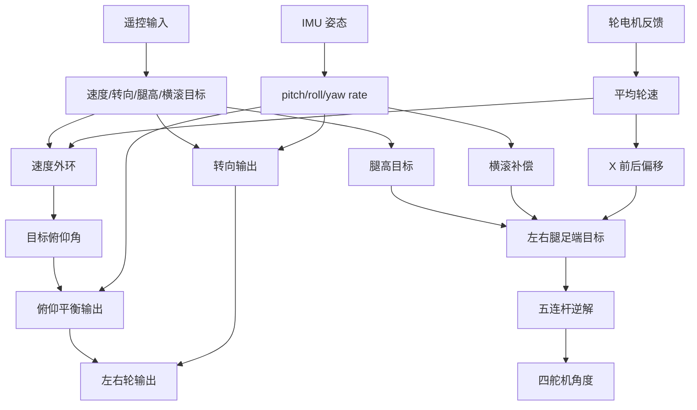

# 轮腿控制参考文档

本文是轮腿控制资料的持续汇总底稿。当前版本先整理五类资料：

- 本仓库本地参考工程：`local/reference/bipedal_wheeled_robot`
- StackForce 大轮足机器人：`local/reference/gaint_bipedal_wheeled_robot`
- 达妙开源轮足仓：`local/reference/wheel-legged-master`
- 上海交通大学交龙战队 RoboMaster2023 平衡步兵控制系统开源：`local/reference/上海交通大学RoboMaster2023平衡步兵控制系统开源`
- 韭菜的菜关于 RoboMaster 平衡步兵和轮腿控制的文章、视频与可访问旁证

后续继续放参考资料时，建议直接追加到本文的“来源笔记”和“设计对照”两部分。

## 先说结论

`local/reference/bipedal_wheeled_robot` 是一套教学型、Arduino 风格的轮足机器人代码。它的控制逻辑很清楚：姿态读取、速度外环、俯仰平衡、左右轮差动转向、腿高平滑、横滚补偿、五连杆逆解、舵机角度输出。它适合作为“从零到能站能跑”的实现参考。

`local/reference/gaint_bipedal_wheeled_robot` 是 StackForce 的大轮足机器人课程资料。它仍是 Arduino/PlatformIO 风格，但执行层已经从舵机版过渡到关节电机 MIT 力控和轮毂电机速度控制，课程链路包含 LQR、变腿高、五连杆正逆解、VMC 和实机部署。它适合作为“舵机入门工程”和“达妙力控工程”之间的过渡参考。

`local/reference/wheel-legged-master` 是更接近实车力控轮腿的代码参考。它把韭菜的菜那套 LQR + VMC 思路落到了 STM32/H7 和达妙电机力控模式上：左右腿各一个任务，实时算腿长、腿角、LQR 增益、轮力矩、腿部等效力矩，再用 VMC 映射成关节电机扭矩。

上海交通大学那份资料不是固件代码，而是一份比较完整的比赛级控制系统设计说明。它的价值在于：从“双腿全身动力学模型”出发，把运动控制、腿部控制、观测器、自适应防滑、功率限制和陀螺平移这些比赛功能放在同一个框架里看。

韭菜的菜那套思路更接近 RoboMaster 比赛级轮腿：把轮腿看成轮腿倒立摆，使用状态空间模型和随腿长变化的反馈增益做纵向平衡，再用五连杆正运动学和虚拟力映射，把腿部目标力/力矩变成四个关节电机力矩。它适合作为 ARBATOS 后续 MIT 力控轮腿任务的主方向参考。

两者的差别很大：

- 本地教学代码：低门槛，偏位置/速度/PID，舵机腿，轮子输出像力矩命令但底层细节被 `.a` 库封住。
- StackForce 大轮足：关节电机和 VMC 实机代码更多，但仍偏课程实验，参数和符号较多写死。
- 韭菜的菜方案：建模完整，偏力矩闭环，需要可靠状态估计、关节力矩反馈、离地检测和安全切换。
- 达妙 wheel-legged-master：可运行固件，适合看 LQR、VMC、速度观测、离地和跳跃在 MCU 里怎么组织。
- 上交开源：适合看整车层思路，尤其是双腿全身模型、解耦控制、观测器和功率/防滑策略。

## 资料来源

### 本地资料

- `local/reference/bipedal_wheeled_robot/readme.md`
- `local/reference/bipedal_wheeled_robot/课程代码/第三课_变腿高_俯仰自稳定`
- `local/reference/bipedal_wheeled_robot/课程代码/第四课_前后行驶+踹不倒优化`
- `local/reference/bipedal_wheeled_robot/课程代码/第五课_转弯控制_闭环走直线`
- `local/reference/bipedal_wheeled_robot/课程代码/第六课_运动学逆解`
- `local/reference/bipedal_wheeled_robot/课程代码/第七课_滚转姿态控制`
- `local/reference/bipedal_wheeled_robot/课程代码/第八课_复杂地形自适应`
- `local/reference/bipedal_wheeled_robot/课程代码/第九课_仿生腿实现高机动性`
- `local/reference/gaint_bipedal_wheeled_robot/README.md`
- `local/reference/gaint_bipedal_wheeled_robot/课程代码/第八课_LQR最优控制原理/wheel_control.m`
- `local/reference/gaint_bipedal_wheeled_robot/课程代码/第九课_LQR变腿高自稳定实机部署/LQRfitting.m`
- `local/reference/gaint_bipedal_wheeled_robot/课程代码/第九课_LQR变腿高自稳定实机部署/src/main.cpp`
- `local/reference/gaint_bipedal_wheeled_robot/课程代码/第九课_LQR变腿高自稳定实机部署/src/Robot/robot.cpp`
- `local/reference/gaint_bipedal_wheeled_robot/课程代码/第九课_LQR变腿高自稳定实机部署/src/Kinematics/Kinematics.cpp`
- `local/reference/gaint_bipedal_wheeled_robot/课程代码/第十课_VMC/calJacobian.m`
- `local/reference/gaint_bipedal_wheeled_robot/课程代码/第十一课_VMC实现/src/main.cpp`
- `local/reference/gaint_bipedal_wheeled_robot/课程代码/第十一课_VMC实现/src/robot.cpp`
- `local/reference/gaint_bipedal_wheeled_robot/课程代码/第十一课_VMC实现/src/Kinematics/Kinematics.cpp`
- `local/reference/wheel-legged-master/README.md`
- `local/reference/wheel-legged-master/机加版/代码/DM-balance机加工版本/User/APP/chassisR_task.c`
- `local/reference/wheel-legged-master/机加版/代码/DM-balance机加工版本/User/APP/chassisL_task.c`
- `local/reference/wheel-legged-master/机加版/代码/DM-balance机加工版本/User/APP/observe_task.c`
- `local/reference/wheel-legged-master/机加版/代码/DM-balance机加工版本/User/APP/ps2_task.c`
- `local/reference/wheel-legged-master/机加版/代码/DM-balance机加工版本/User/Algorithm/VMC/VMC_calc.c`
- `local/reference/wheel-legged-master/打印件版/仿真/simulation/get_k.m`
- `local/reference/wheel-legged-master/打印件版/仿真/simulation/get_k_length.m`
- `local/reference/wheel-legged-master/打印件版/仿真/simulation/VMC_calc.m`
- `local/reference/上海交通大学RoboMaster2023平衡步兵控制系统开源/README.md`
- `local/reference/上海交通大学RoboMaster2023平衡步兵控制系统开源/WBR_modeling.html`
- `local/reference/上海交通大学RoboMaster2023平衡步兵控制系统开源/WBR_control.html`
- `local/reference/上海交通大学RoboMaster2023平衡步兵控制系统开源/WBR_leg.html`
- `local/reference/上海交通大学RoboMaster2023平衡步兵控制系统开源/note/plan.md`
- `local/reference/上海交通大学RoboMaster2023平衡步兵控制系统开源/assets/control_system/*.jpg`

### 网络资料

- [RoboMaster机器人姿态解算方案开源](https://zhuanlan.zhihu.com/p/540676773)
- [RoboMaster平衡步兵机器人控制系统设计](https://zhuanlan.zhihu.com/p/563048952)
- [五连杆运动学解算与 VMC](https://zhuanlan.zhihu.com/p/613007726)
- [五连杆运动学解算与 VMC 的 B 站视频页](https://www.bilibili.com/video/BV1Hk4y1h7r8/)
- [轮腿倒立摆机器人运动速度估计](https://zhuanlan.zhihu.com/p/689921165)
- [Gitee 资料索引中对三篇文章的定位](https://gitee.com/cambridge-linker/26_season_train/blob/master/doc/reference.md)
- [CSDN 对五连杆 VMC 文章的学习笔记](https://blog.csdn.net/weixin_74923758/article/details/142966261)

说明：`p/540676773`、`p/563048952`、`p/613007726` 已通过真实浏览器读取正文。`p/689921165` 当前仍未读到原文，本文先按资料索引和公开搜索结果整理它的设计意义；等后续拿到原文或你放入离线资料后，需要再补一版“原文确认”。

## 本地参考工程总览

`local/reference/bipedal_wheeled_robot` 是 StackForce 轮足机器人课程代码。目录里除了 3D 模型和 BOM，控制相关主要在 `课程代码` 下，每节课一个 PlatformIO 工程。

控制能力按课程递进：

1. 读 IMU 姿态。
2. 用 4 个舵机切换腿高。
3. 固定腿高下，用轮子维持俯仰平衡。
4. 加速度外环，让机器人能前后走。
5. 加转向差动。
6. 做五连杆逆解，用目标足端坐标算四个舵机角度。
7. 用左右腿高度差控制横滚。
8. 用横滚姿态误差做地形适应。
9. 综合速度、转向、腿高、横滚和逆解。

这套代码的优点是控制链条直观。缺点也明显：全局变量多、周期不固定、没有系统级安全保护、很多量没有统一单位和限幅，不能直接搬到 ARBATOS 的实时任务里。

## 硬件和软件假设

本地参考代码默认硬件大概是：

- 主控：Arduino/ESP32 风格，PlatformIO 工程。
- 姿态：MPU6050，经 I2C 读取。
- 腿部：PCA9685 PWM 舵机板，4 个舵机控制左右腿前后连杆。
- 轮子：`SF_BLDC` 电机库，底层只有 `libSF_BLDC.a`，源码不可见。
- 遥控：SBUS 接收机。

关键库：

- `SF_IMU`：读取 MPU6050，做简单互补滤波。
- `SF_Servo`：PCA9685 舵机输出，支持角度转 PWM。
- `SF_BLDC`：双无刷轮电机接口，只能看到头文件和数据结构，具体串口协议和模式含义看不到。
- `pid`：简单 PID，带输出限幅和输出变化率限幅。

## 本地代码的控制数据

### 遥控输入

最终版 `lesson9_enhance` 里用 6 个 SBUS 通道：

- `RCValue[0]`：转向。
- `RCValue[1]`：前后速度。
- `RCValue[2]`：腿高。
- `RCValue[3]`：横滚目标角。
- `RCValue[4]`、`RCValue[5]`：读取了，但主控制里基本没用。

通道范围：

- `RCCHANNEL_MIN = 600`
- `RCCHANNEL_MAX = 1400`
- `RCCHANNEL3_MIN = 200`
- `RCCHANNEL3_MID = 1000`
- `RCCHANNEL3_MAX = 1800`

映射关系：

```cpp
robotMotion.turn = map(RCValue[0], 600, 1400, -5, 5);
targetSpeed = map(RCValue[1], 600, 1400, -20, 20);
Y_demand = map(RCValue[2], 200, 1800, lowest, highest);
Phi = map(RCValue[3], 600, 1400, -rollLimit, rollLimit);
```

这里 `map()` 是 Arduino 整数映射，返回值再赋给 `float`。这意味着输入精度会先被整数化。

### 机器人姿态

`SF_IMU` 中的互补滤波逻辑：

1. 读取 MPU6050 原始加速度和陀螺仪。
2. 加速度除以 `16384.0`，对应 `±2g`。
3. 陀螺仪除以 `65.5`，对应 `±500 deg/s`。
4. 开机时采 3000 次陀螺仪数据做零偏。
5. 加速度算两轴倾角。
6. 用 `0.97` 陀螺仪积分加 `0.03` 加速度倾角做融合。

核心形式：

```cpp
angle[0] = gyroCoef * (angle[0] + gyro[0] * dt) + accCoef * angleAcc[0];
angle[1] = gyroCoef * (angle[1] + gyro[1] * dt) + accCoef * angleAcc[1];
angle[2] = angleGyro[2];
```

注意：

- yaw 只靠陀螺仪积分，长期会漂。
- `lesson9_enhance` 里因为安装方向，做了轴变换：

```cpp
robotPose.pitch = -mpu6050.angle[0];
robotPose.roll = mpu6050.angle[1];
robotPose.yaw = mpu6050.angle[2];
robotPose.GyroX = mpu6050.gyro[1];
robotPose.GyroY = -mpu6050.gyro[0];
robotPose.GyroZ = -mpu6050.gyro[2];
```

迁移到 ARBATOS 时，不能照抄这个轴变换。要按实际 IMU 安装方向做一次清晰的坐标定义。

### 轮电机反馈

`SF_BLDC_DATA` 包含：

```cpp
M0_Angle, M0_ElecAngle, M0_Vel, M0_Uq, M0_Ud, M0_Iq, M0_Id
M1_Angle, M1_ElecAngle, M1_Vel, M1_Uq, M1_Ud, M1_Iq, M1_Id
```

控制代码实际只用 `M0_Vel`、`M1_Vel` 算平均速度：

```cpp
speedAvg = (M0Dir * BLDCData.M0_Vel + M1Dir * BLDCData.M1_Vel) / 2;
```

最终版中：

```cpp
M0Dir = -1;
M1Dir = -1;
```

不同课程中方向值不一致。说明这套代码是边调边写的，电机正方向需要实机确认。

### 舵机输出

舵机走 PCA9685，最终版用角度接口：

```cpp
servos.setAngle(3, servoLeftFront);
servos.setAngle(4, servoLeftRear);
servos.setAngle(5, servoRightFront);
servos.setAngle(6, servoRightRear);
```

角度范围和 PWM 范围：

```cpp
servos.setAngleRange(0, 300);
servos.setPluseRange(500, 2500);
```

`setAngle()` 内部把角度映射到微秒脉宽，再转成 12 位 PWM：

```cpp
offTime = pluseMin + pluseRange * angle / angleRange;
off = offTime * 4096 / 20000;
```

这是一套舵机腿方案。对 MIT 电机力控轮腿，只能参考几何和控制结构，输出层要完全换掉。

## 本地课程代码逐节总结

### lesson3_poseRead：读姿态

路径：

- `第三课_变腿高_俯仰自稳定/lesson3_poseRead/src/main.cpp`
- `lesson3_poseRead/lib/SF_IMU/SF_IMU.cpp`

主循环只做一件事：更新 IMU，然后打印姿态和角速度。

```cpp
mpu6050.update();
roll = mpu6050.angle[0];
pitch = mpu6050.angle[1];
yaw = mpu6050.angle[2];
gyroX = mpu6050.gyro[0];
gyroY = mpu6050.gyro[1];
gyroZ = mpu6050.gyro[2];
```

这一节的控制意义：

- 明确最小姿态输入：roll、pitch、yaw、gyro。
- 给后续平衡控制准备 pitch 和 gyro。
- 使用的是简单互补滤波，不是比赛级状态估计。

迁移建议：

- ARBATOS 已有 INS/IMU 链路，应该使用本项目已有姿态快照，不要移植这份 MPU6050 代码。
- 可参考它“开机静止校准零偏”的流程，但 ARBATOS 应该用已有 BMI088/INS 机制。

### lesson3_differheight：固定 PWM 腿高

路径：

- `第三课_变腿高_俯仰自稳定/lesson3_differheight/src/main.cpp`

这节不做闭环，只轮流给四个舵机 PWM：

```cpp
setRobotHeight(275,168,244,178);
delay(5000);
setRobotHeight(294,154,260,162);
delay(5000);
setRobotHeight(313,139,277,146);
delay(5000);
```

这一节的控制意义：

- 腿高一开始是经验表，不是几何解算。
- 四个舵机值分别对应左前、左后、右前、右后。
- 它验证了机构能通过 4 个舵机同步改变高度。

局限：

- 没有角度单位。
- 没有腿长真实反馈。
- 没有碰撞、限位、慢启动。

迁移建议：

- 可以把这种“预设姿态表”作为调试模式。
- 正式控制不要使用固定 PWM 表，应使用腿长/足端坐标目标。

### lesson3_Stable：固定腿高下的俯仰自稳定

路径：

- `第三课_变腿高_俯仰自稳定/lesson3_Stable/src/main.cpp`

控制链：

```text
IMU pitch -> pitch 误差 -> 轮电机目标输出
```

核心逻辑：

```cpp
pitch = mpu6050.angle[0];
target = kp * (0 - pitch);
motors.setTargets(M0Dir * target, M1Dir * target);
```

它支持三档固定腿高：

```cpp
height0 = {275,168,244,178};
height1 = {294,152,260,162};
height2 = {320,170,265,110};
```

不同腿高用不同 P 值：

```cpp
kp1 = 0.38;
kp2 = 0.4;
kp3 = 0.45;
```

控制思想：

- 把机器人先当成普通两轮倒立摆。
- 车体前倾就给轮子一个方向输出，试图把接地点移到重心下方。
- 腿长变化会改变系统重心和惯量，所以不同腿高需要不同增益。

重要局限：

- 没有速度环，机器人会为了保持姿态自己漂走。
- 没有 pitch 角速度项，抗扰和阻尼不够。
- 目标角固定为 0，不能主动前进。
- `command` 默认值未明确初始化，首次运行可能进入无效指令。

迁移建议：

- 可作为舵机轮腿最小站立测试模式。
- 不适合作为正式行驶控制。

### lesson4_VelCtrl：速度外环加俯仰内环

路径：

- `第四课_前后行驶+踹不倒优化/lesson4_VelCtrl/src/main.cpp`

控制链：

```text
目标速度 - 轮速平均值
  -> PID_VEL
  -> 目标俯仰角 targetAngle
  -> pitch 误差
  -> 轮电机输出 torque
```

核心逻辑：

```cpp
speedAvg = (M0Dir * BLDCData.M0_Vel + M1Dir * BLDCData.M1_Vel) / 2;
targetAngle = PID_VEL(targetSpeed - speedAvg);
torque = kp1 * (targetAngle - pitch);
motors.setTargets(M0Dir * torque, M1Dir * torque);
```

`PID_VEL` 参数：

```cpp
PIDController PID_VEL{0.2, 0, 0, 1000, 50};
```

意思是：

- 速度误差用 P 控制。
- 输出限幅 50。
- 输出变化率限幅 1000。

控制思想：

- 外环速度误差不直接给轮子，而是变成目标倾角。
- 目标倾角再通过内环让机器人主动倾斜，靠倒立摆机制加减速。
- 这比 lesson3 的“只保持 0 度”更接近可行驶平衡车。

重要局限：

- `targetSpeed` 在 `read()` 后又被强制置 0，所以当前代码实际是原地平衡。
- 没有内环 D 项。
- 没有速度估计滤波。
- 轮速直接平均，遇到打滑会误判车体速度。

迁移建议：

- 这个“速度外环生成目标倾角”的思路适合舵机轮腿初版。
- 对 MIT 力控轮腿，应该升级为模型反馈，不要长期停留在这个串级 P/PID。

### lesson5_TurnCtrl：左右轮差动转向

路径：

- `第五课_转弯控制_闭环走直线/lesson5_TurnCtrl/src/main.cpp`

意图上的控制链：

```text
目标航向角速度 - 实测 yaw 角速度
  -> 转向力矩 turnTorque
  -> 左右轮一加一减
```

核心逻辑：

```cpp
turnTorque = turnKp * (robotMotion.turn - robotPose.GyroZ);
torque1 = kp1 * (targetAngle - pitch) + turnTorque;
torque2 = kp1 * (targetAngle - pitch) - turnTorque;
motors.setTargets(M0Dir * torque1, M1Dir * torque2);
```

控制思想：

- 前后平衡输出是左右轮同向分量。
- 转向输出是左右轮反向分量。
- 两者叠加后形成左右轮目标。

代码问题：

- `turnKp` 声明后没有赋值，默认是 0，转向输出实际为 0。
- `pitch` 这个全局变量没有在 `getMPUValue()` 里更新，代码应该用 `robotPose.pitch`。
- `targetSpeed = 15` 是硬编码。

迁移建议：

- 差动转向的结构可以参考。
- 需要明确 yaw 角速度单位、方向和限幅。
- 转向时要同时管腿，否则会出现左右腿被差动力矩扯开的现象。韭菜的菜文章里专门提到“双腿协调”就是解决这个问题。

### lesson6_HeightCtrl：五连杆逆解

路径：

- `第六课_运动学逆解/lesson6_HeightCtrl/src/main.cpp`
- `第六课_运动学逆解/lesson6_HeightCtrl/src/bipedal_data.h`

这节是本地参考工程里最值得复用的舵机轮腿部分。

几何参数：

```cpp
L1 = 60;
L2 = 100;
L3 = 100;
L4 = 60;
L5 = 40;
```

输入：

```cpp
IKParam.XLeft
IKParam.YLeft
IKParam.XRight
IKParam.YRight
```

输出：

```cpp
IKParam.alphaLeft
IKParam.betaLeft
IKParam.alphaRight
IKParam.betaRight
```

再映射成舵机角度：

```cpp
servoLeftFront = 90 + betaLeftToAngle;
servoLeftRear = 90 + alphaLeftToAngle;
servoRightFront = 270 - betaRightToAngle;
servoRightRear = 270 - alphaRightToAngle;
```

左腿逆解核心：

```cpp
aLeft = 2 * XLeft * L1;
bLeft = 2 * YLeft * L1;
cLeft = XLeft^2 + YLeft^2 + L1^2 - L2^2;
dLeft = 2 * L4 * (XLeft - L5);
eLeft = 2 * L4 * YLeft;
fLeft = (XLeft - L5)^2 + L4^2 + YLeft^2 - L3^2;

alpha1 = 2 * atan((bLeft + sqrt(aLeft^2 + bLeft^2 - cLeft^2)) / (aLeft + cLeft));
alpha2 = 2 * atan((bLeft - sqrt(aLeft^2 + bLeft^2 - cLeft^2)) / (aLeft + cLeft));
beta1  = 2 * atan((eLeft + sqrt(dLeft^2 + eLeft^2 - fLeft^2)) / (dLeft + fLeft));
beta2  = 2 * atan((eLeft - sqrt(dLeft^2 + eLeft^2 - fLeft^2)) / (dLeft + fLeft));
```

分支选择：

```cpp
if (alpha1 >= PI/4) alphaLeft = alpha1;
else alphaLeft = alpha2;

if (beta1 >= 0 && beta1 <= PI/4) betaLeft = beta1;
else betaLeft = beta2;
```

右腿同理，只是几何方向和角度映射不同。

控制思想：

- 用足端目标点 `(X,Y)` 控制腿。
- `Y` 主要代表腿高。
- `X` 代表轮轴相对机体前后偏置，可用于主动调整支撑点。
- 逆解输出的是舵机角度，不考虑关节力矩。

重要问题：

- `sqrt()` 里的值没有判负，超出工作空间会出 NaN。
- `atan()` 用的是普通 `atan`，不是 `atan2`，分母接近 0 时风险大。
- 没有舵机限位和速度限制。
- 左右腿分支选择依赖机构装配，不能通用。

迁移建议：

- 这部分适合作为 `wheelleg_servo_kinematics` 的初版。
- 一定要增加工作空间检查、角度限幅、角速度限幅和错误输出。

### lesson7_RollCtrl：横滚目标转左右腿高度差

路径：

- `第七课_滚转姿态控制/lesson7_RollCtrl/src/main.cpp`

这节把遥控横滚目标 `Phi` 转成左右腿高度差：

```cpp
Phi = map(RCValue[3], RCCHANNEL_MIN, RCCHANNEL_MAX, -rollLimit, rollLimit);
E_H = (L / 2) * sin(Phi * (PI / 180));
L_Height = Remoter_Input + E_H;
R_Height = Remoter_Input - E_H;
```

其中：

- `L = 100`，代码注释写“体长”，实际更像左右腿间距的一半或用于高度差估算的结构尺度。
- `Phi` 是横滚目标角，单位是度。
- `E_H` 是让车体达到横滚角所需的左右高度偏移。

控制思想：

- 先定一个平均腿高。
- 横滚目标不直接给舵机角度，而是变成左右腿高差。
- 左右腿分别走五连杆逆解。

局限：

- 它是开环横滚目标，没有用 IMU roll 闭环。
- 坡面上只能按遥控倾斜，不能自动保持机身水平。

迁移建议：

- 可保留为手动横滚命令。
- 正式控制里横滚目标应和 IMU roll、地面估计、转向离心补偿一起进入腿长控制。

### lesson8_adaptive：复杂地形自适应

路径：

- `第八课_复杂地形自适应/lesson8_adaptive/src/main.cpp`

这节加入姿态反馈，让左右腿高根据 roll 自动调整：

```cpp
stab_roll = stab_roll + Kp_roll * (0 - robotPose.roll);
L_Height = Remoter_Input + stab_roll;
R_Height = Remoter_Input - stab_roll;
```

控制思想：

- 如果机身向一侧倾斜，就加高一侧腿、降低另一侧腿。
- 目标是让 roll 回到 0。
- 这就是最朴素的“主动悬挂”。

需要特别注意：

- 变量名叫 `Kp_roll`，但代码写法是累加，行为更像积分。
- 没有限幅、没有泄漏、没有时间步长，长期运行容易积累过大。
- 这一节仍然算了 `Phi` 和 `E_H`，但最终没有使用 `E_H`。

迁移建议：

- 这个思路可以保留，但实现必须改成明确的控制器：
  - 输入：roll 误差、roll 角速度、腿长反馈。
  - 输出：左右腿长差或左右腿推力差。
  - 必须有限幅、复位条件、离地处理。

### lesson9_enhance：综合版

路径：

- `第九课_仿生腿实现高机动性/lesson9_enhance/src/main.cpp`

主循环顺序：

```cpp
BLDCData = motors.getBLDCData();
getMPUValue();
getRCValue();

robotMotion.turn = map(RCValue[0], ...);
targetSpeed = map(RCValue[1], ...);
Y_demand = map(RCValue[2], ...);
Phi = map(RCValue[3], ...);

speedAvg = (M0Dir * M0_Vel + M1Dir * M1_Vel) / 2;
targetAngle = PID_VEL(targetSpeed - speedAvg);
turnTorque = turnKp * (robotMotion.turn - robotPose.GyroZ);
torque1 = kp1 * (targetAngle - robotPose.pitch) + turnTorque;
torque2 = kp1 * (targetAngle - robotPose.pitch) - turnTorque;
motors.setTargets(M0Dir * torque1, M1Dir * torque2);

X = -Kp_x * (targetSpeed - speedAvg);
Y = Y + Kp_Y * (Y_demand - Y);
stab_roll = stab_roll + Kp_roll * (0 - robotPose.roll);

IKParam.XLeft = X;
IKParam.XRight = X;
IKParam.YLeft = Y + stab_roll;
IKParam.YRight = Y - stab_roll;
inverseKinematics();
```

控制链拆开看：

```text
遥控速度 -> 目标速度
轮速平均 -> 实际速度粗估
速度误差 -> 目标俯仰角
目标俯仰角 - 实测 pitch -> 左右轮共同输出

遥控转向 -> 目标 yaw 角速度
目标 yaw 角速度 - 实测 GyroZ -> 左右轮差动输出

遥控腿高 -> 目标平均腿高
平均腿高一阶平滑 -> 左右共同腿高

实测 roll -> 左右腿高差补偿

速度误差 -> X 前后偏移
X/Y -> 五连杆逆解 -> 四个舵机角度
```

最终版新增的关键点是：

```cpp
X = -Kp_x * (targetSpeed - speedAvg);
```

这表示速度误差除了影响目标俯仰角，也会改变轮轴相对机体的前后位置。直观理解：

- 想加速但速度不够时，让腿把轮子放到更合适的位置。
- 支撑点前后移动后，倒立摆的力臂改变，机器人更容易加减速。

但这条逻辑仍然是经验 P 控制，没有完整动力学模型。

重要问题：

- `turnKp` 仍未赋值，转向闭环实际可能为 0。
- `Phi` 和 `E_H` 仍然没有真正参与最终腿高输出。
- `stab_roll` 无限制累加。
- 轮速平均值直接当车速，打滑时不可靠。
- 没有遥控失联处理。
- 没有离地检测。
- 没有摔倒保护。
- 没有周期固定和计算耗时控制。

## 本地参考工程的总体控制思路

本地工程可以浓缩成两个闭环和一个几何解算：

### 纵向平衡和速度

```text
targetSpeed - speedAvg
    -> velocity PID
    -> targetPitch

targetPitch - pitch
    -> pitch P
    -> wheel common output
```

再加转向：

```text
targetYawRate - gyroZ
    -> yaw P/PD
    -> wheel differential output
```

左右轮：

```text
leftWheel  = common + turn
rightWheel = common - turn
```

### 腿高和横滚

```text
targetHeight -> smoothHeight
rollError -> rollHeightOffset

leftY  = smoothHeight + rollHeightOffset
rightY = smoothHeight - rollHeightOffset
```

### 五连杆逆解

```text
leftX, leftY, rightX, rightY
    -> inverseKinematics()
    -> left front/rear angle, right front/rear angle
    -> servo output
```

### 最终综合结构



## 本地参考工程迁移价值

### 值得保留

- “速度外环生成目标俯仰角”的串级思路，适合舵机轮腿最小版本。
- “转向输出左右轮一加一减”的结构。
- “腿高先平滑，再进入逆解”的结构。
- “横滚误差转左右腿高差”的主动悬挂直觉。
- 五连杆逆解的基本几何关系。
- 课程递进顺序可以作为 ARBATOS bringup 顺序。

### 不能照搬

- Arduino 全局变量主循环。
- 不固定周期的控制器。
- 无安全保护的舵机输出。
- `stab_roll += error` 这种无限累加写法。
- 无工作空间检查的五连杆逆解。
- 直接把轮速平均当车体速度。
- 用隐藏库 `SF_BLDC` 的输出语义当通用力矩语义。

### 建议的 ARBATOS 舵机轮腿最小闭环

第一版不要直接做比赛级 LQR。可以先做一个可验证的舵机轮腿任务：

1. 使用 ARBATOS 现有 IMU 姿态快照。
2. 使用遥控输入快照生成 `target_speed`、`target_yaw_rate`、`target_height`。
3. 用轮速或底盘估计生成 `speed_estimate`。
4. 速度外环得到 `target_pitch`。
5. pitch 控制得到左右轮共同输出。
6. yaw rate 控制得到左右轮差动输出。
7. 腿高目标做一阶平滑。
8. roll 控制得到左右腿高差。
9. 五连杆逆解得到舵机角度。
10. 输出前做工作空间、角度、角速度、安全状态检查。

## 韭菜的菜：RoboMaster 平衡步兵机器人控制系统设计

来源：

- <https://zhuanlan.zhihu.com/p/563048952>

这篇文章是本文目前能直接读取的主资料。它讨论的是哈尔滨工程大学创梦之翼战队 RoboMaster 2022 平衡步兵控制系统。

### 总体问题定义

文章把机器人分成：

- 机体。
- 驱动轮。
- 腿部机构的等效摆杆。

它重点解决的是平衡与纵向运动控制。建模时先忽略腿长变化，只考虑腿姿态和轮子运动。

状态向量：

```text
x = [theta, theta_dot, x, x_dot, phi, phi_dot]^T
```

含义按文章上下文理解：

- `theta`：摆杆/腿相对惯性系角度。
- `x`：轮子或机器人水平位置。
- `phi`：机体俯仰角。

控制向量：

```text
u = [T, T_p]^T
```

含义：

- `T`：驱动轮力矩。
- `T_p`：腿部绕中心轴对机体/摆杆产生的力矩。

控制目标不是“只让机体 pitch 等于 0”，而是同时控制：

- 腿部姿态。
- 车体位置和速度。
- 机体俯仰姿态。
- 驱动轮与腿部关节输出。

### 动力学建模

文章用经典力学分别对驱动轮、摆杆、机体列方程，再消去内部作用力，得到非线性模型：

```text
x_dot = f(x, u)
```

再在平衡点线性化：

```text
A = df/dx
B = df/du
```

平衡点：

```text
x_bar = [0, 0, x, 0, 0, 0]^T
u_bar = [0, 0]^T
```

文章认为所有状态都可以通过直接测量或融合解算得到，所以输出矩阵可以看成单位阵。

控制意义：

- 这是正式模型控制的入口。
- 与本地教学代码相比，它不再只看 pitch 和 wheel speed，而是把腿角、机体角、位置速度都放进状态向量。

### LQR：纵向平衡主控制器

文章用 LQR（线性二次型调节器，简单说就是按状态误差自动算一组反馈增益）来求反馈矩阵。

控制律：

```text
u = K * (x_d - x)
```

其中：

```text
x_d = [0, 0, x_target, 0, 0, 0]^T
```

也就是希望机器人位置跟踪目标，同时保持腿和机体姿态稳定。

关键点：

- 腿长变化会改变模型。
- 文章按腿长区间每 10 mm 线性化一次，分别求反馈矩阵。
- 再把每个反馈增益元素拟合成腿长的三次多项式：

```text
K_ij(L0) = p0 + p1 * L0 + p2 * L0^2 + p3 * L0^3
```

最终在线控制时：

```text
u = K(L0) * (x_d - x)
```

这点很重要。它说明比赛级轮腿不能只用一组固定 PID，因为腿高变化会明显改变系统动力学。

### 五连杆和虚拟力映射

文章里腿部不是舵机位置控制，而是关节电机力矩控制。

它先通过五连杆正运动学得到腿长 `L0` 和腿角 `phi0`。然后使用虚拟模型控制（VMC，简单说就是先在腿的工作空间里设计一个想要的推力/力矩，再映射回关节电机力矩）。

工作空间量：

```text
x = [L0, phi0]^T
```

关节空间量：

```text
q = [phi1, phi4]^T
```

雅可比矩阵：

```text
delta x = J * delta q
```

虚功关系得到：

```text
T_joint = J^T * F_virtual
```

其中：

```text
T_joint = [T1, T2]^T
F_virtual = [F, T_p]^T
```

含义：

- `F`：沿腿方向的虚拟推力，用于腿长/支撑力控制。
- `T_p`：绕腿中心轴的虚拟力矩，用于平衡模型里的腿部力矩。
- `T1/T2`：两个实际关节电机力矩。

控制意义：

- LQR 给出的是轮子力矩和腿部等效力矩。
- 腿部等效力矩不能直接发给关节电机。
- 必须通过五连杆几何和雅可比矩阵映射成关节力矩。

### 仿真和实机验证

文章用 Simscape Multibody 做仿真，验证模型和控制器。实机部分提到：

- 质量来自称重。
- 驱动轮和轮毂转动惯量用电机力矩反馈做系统辨识。
- 摆杆转动惯量用平行轴定理。
- 机体转动惯量和质心位置来自机械图纸，精度较粗。
- 用这些参数拟合 `K(L0)`。

文章给出的实机效果是：跟踪 2 m/s 阶跃速度期望时，机体俯仰姿态保持在一定范围内，说明模型控制能兼顾加速性能和机体姿态稳定。

迁移意义：

- ARBATOS 如果做 MIT 轮腿，参数辨识和仿真验证不能省。
- 先有模型，再求增益，再上实机，比盲调 PID 更稳。

### 综合运动控制

文章认为纵向平衡只是核心部分，完整运动还要加：

1. 转向控制。
2. 双腿协调。
3. 腿长控制。
4. 横滚补偿。
5. 离地检测。

#### 转向控制

转向用目标航向角速度和姿态解算得到的航向角速度做误差，经过 PD 得到转向力矩。这个力矩以相反符号叠加到左右轮力矩：

```text
left_wheel_torque  = balance_torque + yaw_torque
right_wheel_torque = balance_torque - yaw_torque
```

这个和本地 `lesson5/lesson9` 的差动结构一致。

#### 双腿协调

文章指出：转向时左右轮力矩差会给机器人一个沿地面法线方向的力矩，驱动转向的同时也会让两条腿向相反方向摆动，造成“劈叉”。

解决办法：

```text
delta_theta = right_leg_theta - left_leg_theta
```

对 `delta_theta` 做 PD，输出一个让左右腿角度保持一致的力矩，再以相反符号叠加到左右腿的 `T_p`。

这个点本地参考工程没有真正解决。它只对左右轮加差动，没有管腿部同步。正式轮腿必须补。

#### 腿长控制

文章把腿长控制做成弹簧阻尼系统：

```text
F_leg = Kp * (L_target - L) + Kd * (L_dot_target - L_dot) + Ki * integral + feedforward
```

人话解释：

- PD 模拟弹簧和阻尼。
- 前馈补偿上层机构重力。
- I 项修正前馈不准的问题。

本地参考工程的 `Y = Y + Kp_Y * (Y_demand - Y)` 只是在做腿高平滑，不是真正腿长力控。

#### 横滚角补偿

文章指出，为了减震，腿长控制里的 `Kp` 不应太大。但 `Kp` 小了以后，转向离心力等扰动会让机身横滚。解决办法是额外做横滚角补偿：

```text
roll_error = roll_target - roll_estimate
roll_comp = K_roll * roll_error
left_leg_force  += roll_comp
right_leg_force -= roll_comp
```

这和本地 `lesson8/lesson9` 的左右腿高度差补偿思路方向一致，但文章输出的是左右腿沿腿推力，不是舵机高度。

#### 综合输出

完整控制最后得到 6 个电机目标：

- 左右驱动轮力矩：`left_T`、`right_T`
- 左右腿绕中心轴力矩：`left_Tp`、`right_Tp`
- 左右腿沿腿推力：`left_F`、`right_F`

然后对左右腿分别做：

```text
[joint_torque_1, joint_torque_2]^T = J^T * [F, T_p]^T
```

最终输出：

- 2 个轮电机力矩。
- 4 个关节电机力矩。

这就是 MIT 力控轮腿和舵机轮腿最大的差异。

### 离地检测

文章认为双轮离地后，综合平衡控制无法继续稳定姿态，需要切换控制策略。

离地判断思路：

- 用加速度计和关节电机力矩反馈解算驱动轮竖直方向支持力 `F_N`。
- 当支持力低于阈值，比如文章中给出的 `20 N`，认为离地。
- 离地后把反馈增益矩阵中大部分项置零，只保留部分腿部姿态控制，让空中姿态不要发散。

控制意义：

- 正式轮腿必须有“在地/离地/落地冲击”的状态机。
- 否则飞坡、跳台阶、被撞飞时，地面平衡控制会给出错误输出。

## 韭菜的菜：RoboMaster 机器人姿态解算方案开源

来源：

- <https://zhuanlan.zhihu.com/p/540676773>

这篇文章不是专门讲轮腿结构，但对轮腿控制很关键：轮腿平衡控制高度依赖姿态角、角速度和运动加速度处理。姿态解算质量差，后面的 LQR、腿长控制、横滚补偿都会拿到错误状态。

文章的重点是开源一套可以直接在 RoboMaster C 型开发板上运行的姿态解算方案。作者提到这套方案覆盖了陀螺仪零偏校准、运动加速度影响姿态解算等问题，并把 Kalman Filter 的代码实现和原理作为相关参考。评论里还说明，实际 EKF 流程不在 `main` 里，而是在 FreeRTOS 的任务里。

对轮腿控制的意义：

- `pitch` 和 `pitch_rate` 是纵向平衡主状态，误差会直接变成轮子力矩错误。
- `roll` 和 `roll_rate` 是横滚补偿主状态，误差会让左右腿支撑力或腿高差方向错。
- `yaw_rate` 是差动转向控制的反馈量，噪声大时转向力矩会抖。
- 运动加速度会污染加速度计倾角，轮腿急加速、急刹、落地冲击时尤其明显。
- 陀螺仪零偏没处理好，站立时会慢慢漂，控制器会不断给出“自认为正确”的错误输出。

和本地 `bipedal_wheeled_robot` 的关系：

- 本地代码用 MPU6050 互补滤波，权重固定为 `gyro=0.97`、`acc=0.03`，能跑教学演示，但抗运动加速度能力有限。
- 韭菜的菜这篇更适合作为 ARBATOS 姿态估计质量标准：正式轮腿任务应从项目已有 INS/IMU 快照取姿态，不要把教学代码里的 MPU6050 互补滤波搬进来。
- 如果后续做速度估计、离地检测和落地冲击判断，姿态估计任务还要把加速度可信度、陀螺仪状态、校准状态一起提供给轮腿任务。

迁移到 ARBATOS 时建议留这些接口：

```c
typedef struct
{
    fp32 roll_rad;
    fp32 pitch_rad;
    fp32 yaw_rad;
    fp32 roll_rate_rps;
    fp32 pitch_rate_rps;
    fp32 yaw_rate_rps;
    fp32 accel_body_mps2[3];
    uint8_t imu_ready;
    uint8_t gyro_calibrated;
    uint8_t accel_trusted;
} wheelleg_attitude_snapshot_t;
```

其中 `accel_trusted` 很重要。机器人剧烈运动或离地时，加速度计不再只反映重力方向，控制器应降低加速度姿态修正的权重，或者在状态估计层直接给出“当前姿态可信度较低”的标志。

## 韭菜的菜：五连杆运动学解算与 VMC

来源：

- <https://zhuanlan.zhihu.com/p/613007726>
- <https://www.bilibili.com/video/BV1Hk4y1h7r8/>
- <https://blog.csdn.net/weixin_74923758/article/details/142966261>

这篇文章聚焦一个问题：五连杆腿部的实际关节电机输出，如何和虚拟摆杆上的力/力矩对应起来。

核心内容是：

1. 给定五连杆几何，利用左右闭链关系求中间连杆角。
2. 从正运动学得到末端点或虚拟腿的 `L0`、`phi0`。
3. 通过速度映射求雅可比矩阵，而不是直接对复杂正运动学表达式求符号导。
4. 用虚功原理得到 `T = J^T F`。
5. 这样可以把沿腿推力和绕腿力矩变成前后两个关节电机力矩。

特别值得记住的一点：

直接对完整五连杆正运动学求雅可比矩阵，表达式会很复杂，不利于嵌入式实现。更实用的方法是从速度关系入手推 `J`，让实时计算更简单。

### 正运动学

文章把五连杆的两个主动关节定义为 `A`、`E`，对应编码器可测角：

```text
q = [phi1, phi4]^T
```

控制中关注的是末端 `C` 点，可以用直角坐标 `(x, y)`，也可以用极坐标：

```text
x_task = [L0, phi0]^T
```

左右闭链关系：

```text
xB + l2 cos(phi2) = xD + l3 cos(phi3)
yB + l2 sin(phi2) = yD + l3 sin(phi3)
```

由此可求出中间角 `phi2`：

```text
phi2 = 2 atan((B0 + sqrt(A0^2 + B0^2 - C0^2)) / (A0 + C0))
```

其中：

```text
A0 = 2 l2 (xD - xB)
B0 = 2 l2 (yD - yB)
C0 = l2^2 + lBD^2 - l3^2
lBD = sqrt((xD - xB)^2 + (yD - yB)^2)
```

得到 `phi2` 后，末端点：

```text
xC = l1 cos(phi1) + l2 cos(phi2)
yC = l1 sin(phi1) + l2 sin(phi2)
```

再转成虚拟腿极坐标：

```text
L0 = sqrt((xC - l5 / 2)^2 + yC^2)
phi0 = atan(yC / (xC - l5 / 2))
```

这里建议实际写代码时用 `atan2(yC, xC - l5 / 2)`，避免分母接近 0 时角度跳变。

### VMC 力矩映射

文章先定义：

```text
x_task = [L0, phi0]^T
q = [phi1, phi4]^T
dx = J dq
```

也就是雅可比矩阵 `J` 把关节微小变化映射到虚拟腿长度和角度变化。

根据虚功关系：

```text
T_joint = J^T F_virtual
```

其中：

```text
T_joint = [T1, T2]^T
F_virtual = [F, Tp]^T
```

人话解释：

- `F` 是沿腿方向的推力。
- `Tp` 是让虚拟腿绕中心轴摆动的力矩。
- `T1/T2` 是两个主动关节电机要输出的实际力矩。

### 速度映射求雅可比

文章没有直接对复杂正运动学求导，而是先求速度映射。核心步骤：

```text
xdotC = -l1 phidot1 sin(phi1) - l2 phidot2 sin(phi2)
ydotC =  l1 phidot1 cos(phi1) + l2 phidot2 cos(phi2)
```

再由闭链速度关系消去 `phidot3`，得到：

```text
phidot2 =
((xdotD - xdotB) cos(phi3) + (ydotD - ydotB) sin(phi3))
/ (l2 sin(phi3 - phi2))
```

其中：

```text
xdotB = -l1 phidot1 sin(phi1)
ydotB =  l1 phidot1 cos(phi1)
xdotD = -l4 phidot4 sin(phi4)
ydotD =  l4 phidot4 cos(phi4)
```

整理后可得到直角坐标速度映射：

```text
[xdotC, ydotC]^T = J_xy [phidot1, phidot4]^T
```

`J_xy` 的矩阵形式：

```text
J_xy =
[ l1 sin(phi1 - phi2) sin(phi3) / sin(phi2 - phi3),
  l4 sin(phi3 - phi4) sin(phi2) / sin(phi2 - phi3);
 -l1 sin(phi1 - phi2) cos(phi3) / sin(phi2 - phi3),
 -l4 sin(phi3 - phi4) cos(phi2) / sin(phi2 - phi3) ]
```

这个矩阵把两个主动关节速度映射成末端 `C` 点的直角坐标速度。

### 从直角力到腿向力/力矩

文章先有：

```text
[T1, T2]^T = J_xy^T [Fx, Fy]^T
```

再用旋转矩阵把直角力 `[Fx, Fy]` 变成极坐标方向的力：

```text
[Fx, Fy]^T = R [Fc, Ft]^T
```

其中 `Ft`、`Fc` 分别对应沿 `L0` 和垂直 `L0` 的虚拟力。再用变换矩阵把最终控制量 `[F, Tp]` 转成 `[Ft, Fc]`：

```text
[Ft, Fc]^T = [0, -1/L0; 1, 0] [F, Tp]^T
```

最后得到文章给出的最终映射：

```text
[T1, T2]^T =
[ l1 sin(phi0 - phi3) sin(phi1 - phi2) / sin(phi3 - phi2),
  l1 cos(phi0 - phi3) sin(phi1 - phi2) / (L0 sin(phi3 - phi2));
  l4 sin(phi0 - phi2) sin(phi3 - phi4) / sin(phi3 - phi2),
  l4 cos(phi0 - phi2) sin(phi3 - phi4) / (L0 sin(phi3 - phi2)) ]
[F, Tp]^T
```

这条公式是 MIT 力控轮腿执行层的核心之一。LQR 或腿长控制算出的 `F/Tp`，最终要靠它变成关节电机力矩。

### 实现注意点

这篇对嵌入式实现的启发很直接：

- 关节角要有清晰零位和正方向，否则公式符号全错。
- `sin(phi3 - phi2)` 出现在分母，接近 0 时机构接近奇异位形，必须限位或降级控制。
- `L0` 出现在分母，腿长过短时 `Tp` 到横向力的换算会放大，必须限制最小腿长。
- 文章公式是力矩映射，不是位置逆解；舵机轮腿不能直接用它发 PWM。
- 如果 ARBATOS 先做舵机版，再做 MIT 版，最好把几何计算公共化，但输出层分开。

对 ARBATOS 的意义：

- 舵机轮腿只需要逆解角度。
- MIT 力控轮腿需要正运动学、速度雅可比、力矩映射。
- 如果要做 `wheelleg_mit_task`，这篇是腿部执行层的关键参考。

待补：

- 把上面的公式整理成可编译 C 函数。
- 用 ARBATOS 目标机构的 `l1..l5`、零位和正方向校验符号。
- 补奇异位形、工作空间、力矩限幅的处理。

## 韭菜的菜：轮腿倒立摆机器人运动速度估计

来源：

- <https://zhuanlan.zhihu.com/p/689921165>
- Gitee 资料索引中把该文定位为“解决打滑问题”

当前原文匿名访问 403，搜索结果能确认标题和定位，但还没有足够原文细节。这里先只写能确定的设计意义，不写具体公式。

为什么需要这篇：

本地教学工程用：

```cpp
speedAvg = (left_wheel_speed + right_wheel_speed) / 2;
```

这只在轮子不打滑时成立。一旦加速、急刹、撞击、坡面、离地，轮速就不等于机体速度。速度估计错了以后，速度外环或 LQR 状态反馈都会拿到错误状态，轻则漂，重则倒。

轮腿速度估计大概率要融合：

- 轮编码器。
- IMU 加速度。
- 机体姿态。
- 腿长和腿角。
- 接触/支持力判断。
- 可能还要对打滑状态调整轮速观测权重。

对 ARBATOS 的意义：

- 舵机轮腿初版可以先用轮速平均，但要把接口留成 `speed_estimate`，不要把轮速写死在控制器里。
- MIT 轮腿正式版需要状态估计模块，至少把“轮速推算速度”和“IMU 积分/模型推算速度”融合。
- 离地或低支持力状态下，应降低或关闭轮速观测权重。

待补：

- 原文完整算法。
- 是否使用 Kalman 滤波。
- 状态量、观测量、噪声矩阵和打滑判别条件。
- 与 ARBATOS 现有 INS/轮速反馈的接口设计。

## 本地参考：StackForce gaint_bipedal_wheeled_robot

路径：

- `local/reference/gaint_bipedal_wheeled_robot`

说明：目录名里写的是 `gaint`，应当是 `giant` 的拼写误差。本文保留原路径名。

这套资料是 StackForce 大轮足机器人课程。它和前面的 `bipedal_wheeled_robot` 有关联，但定位不同：

- `bipedal_wheeled_robot`：小型舵机轮腿，重点是从姿态、速度、腿高、roll、逆解一路搭到能跑。
- `gaint_bipedal_wheeled_robot`：大轮足，重点换成关节电机 MIT 力控、轮毂电机、LQR、变腿高、五连杆正逆解和 VMC。
- `wheel-legged-master`：更完整的达妙 STM32/H7 力控轮腿，包含速度观测、离地、跳跃等实车状态处理。

所以这份资料最适合放在“舵机入门”和“达妙实车代码”之间，用来理解从位置控制腿过渡到关节力矩控制腿时，工程上要补哪些东西。

### 目录和课程线索

顶层目录：

```text
Structure
  Pro/E 结构文件，README 提示用 proe 打开装配体

课程代码
  第四课_关节电机控制
  第五课_运动学正逆解
  第六课_用PID实现变腿高自稳定平衡
  第八课_LQR最优控制原理
  第九课_LQR变腿高自稳定实机部署
  第十课_VMC
  第十一课_VMC实现
```

README 只有一句核心说明：StackForce 大轮足机器人开源项目，结构文件用 Pro/E，课程代码用 VSCode PlatformIO。

课程演进大致是：

```text
关节电机 MIT 控制
  -> 五连杆正逆运动学
  -> PID 变腿高自稳定
  -> LQR 轮腿平衡
  -> LQR 随腿高拟合
  -> VMC 雅可比推导
  -> VMC 实机部署
```

### 硬件和软件环境

第十一课 `platformio.ini`：

```ini
[env:esp32-s3-devkitc-1]
platform = espressif32@6.6.0
board = esp32-s3-devkitc-1
framework = arduino
monitor_speed = 115200

build_flags =
    -Llib/SF_Motor
    -lSF_Motor

lib_deps =
    adafruit/Adafruit NeoPixel@^1.15.1
```

这说明课程固件是 ESP32-S3 + Arduino/FreeRTOS。关节电机走 TWAI/CAN，轮毂电机通过 `libSF_Motor.a` 封装库控制。IMU 是 MPU6050，遥控输入是 PPM。

关键模块：

```text
src/main.cpp
  初始化 I2C、MPU6050、CAN、PPM、轮毂电机，主循环调用控制函数

src/robot.cpp
  轮平衡 LQR、腿部 VMC、遥控映射、roll 补偿、跳跃高度调度

src/Kinematics/Kinematics.cpp
  五连杆正逆解、足端速度估计

src/CAN_comm.cpp
  MIT 控制帧打包、关节电机反馈解析

src/can.cpp
  将 VMC 输出扭矩发给 4 个关节电机

lib/SF_Motor/Motor.h
  轮毂电机目标发送接口，具体实现只有二进制库
```

### 关节电机 MIT 控制

第四课 README 说明了关节电机控制课程的递进：

1. 只调扭矩 `tor`。
2. 只调目标位置 `pos` 和 `kp`。
3. 加目标速度 `vel` 和 `kd`。
4. 加重力前馈。

后续第九课和第十一课已经把关节电机作为 MIT 模式执行器使用。控制帧字段范围在 `config.h`：

```c
posMin = -25.12f;
posMax =  25.12f;
velMin = -65.0f;
velMax =  65.0f;
kpMin  =   0.0f;
kpMax  = 500.0f;
kdMin  =   0.0f;
kdMax  =   5.0f;
torMin = -18.0f;
torMax =  18.0f;
```

`CAN_comm.cpp` 把 MIT 命令打成 8 字节：

```c
pos: 16 bit
vel: 12 bit
kp : 12 bit
kd : 12 bit
tor: 12 bit
```

第十一课中 VMC 输出之后，关节电机发送基本是纯力矩模式：

```c
pos = 0;
vel = 0;
kp  = 0;
kd  = 0;
tor = VMC_output_torque;
```

这和达妙 `wheel-legged-master` 的执行层一致：上层先算关节力矩，再通过 MIT 控制帧发给电机。

### 五连杆几何

第九课和第十一课使用的五连杆尺寸在 `Kinematics.h`：

```c
#define L1 150
#define L2 250
#define L3 250
#define L4 150
#define L5 108
```

单位按代码使用习惯是 mm。`Node` 结构体保存目标点和正解结果：

```c
typedef struct {
    float x;
    float y;
    float polarAngle;
    float radius;
    float frontTorque;
    float backTorque;
} Node;
```

`JointAngles` 保存左右腿主动关节和中间杆角：

```c
typedef struct {
    float alphaLeft;
    float betaLeft;
    float alphaRight;
    float betaRight;
    float thetaRight1;
    float thetaLeft1;
} JointAngles;
```

### 逆运动学

第五课 Matlab 和 C++ 里的逆解形式一致。给目标足端：

```text
X, Y
```

右侧主动杆角 `alpha`：

```text
a = 2 X L1
b = 2 Y L1
c = X^2 + Y^2 + L1^2 - L2^2

alpha = 2 atan2(b +/- sqrt(a^2 + b^2 - c^2), a + c)
```

另一侧主动杆角 `beta`：

```text
d = 2 L4 (X - L5)
e = 2 L4 Y
f = (X - L5)^2 + L4^2 + Y^2 - L3^2

beta = 2 atan2(e +/- sqrt(d^2 + e^2 - f^2), d + f)
```

C++ 版本加了两个实用保护：

```c
safe_sqrt(x)  // x < 0 时返回 0
safe_div(num, denom)  // 分母太小时钳到 1e-6
```

这对课程演示很方便，但迁移到正式控制时不能只“吞掉”不可达点。ARBATOS 里更应该在进入逆解前做工作空间检查，并明确返回错误状态。

### 正运动学

正解从两个主动关节角 `alpha/beta` 出发：

```text
A = [L1 cos(alpha), L1 sin(alpha)]
C = [L5 + L4 cos(beta), L4 sin(beta)]
```

再解中间杆角 `theta1`：

```text
a = 2 (Cx - Ax) L2
b = 2 (Cy - Ay) L2
lAC = sqrt((Cx - Ax)^2 + (Cy - Ay)^2)
c = L2^2 + lAC^2 - L3^2

theta1 = 2 atan2(b +/- sqrt(a^2 + b^2 - c^2), a + c)
```

足端：

```text
x = Ax + L2 cos(theta1)
y = Ay + L2 sin(theta1)
```

再转换成腿长和极角：

```c
polarAngle = atan2f(y, x - 0.5f * L5);
radius = sqrtf((x - 0.5f * L5)^2 + y^2);
```

第十一课对左右腿电机角做了不同零位和限位映射，例如右腿：

```c
alphaPos = devicesState[0].pos;
betaPos  = devicesState[2].pos;

alphaRight = alphaPos + PI/2;
betaRight  = betaPos  + PI/2;
```

左腿：

```c
alphaLeft = PI/2 + devicesState[3].pos;
betaLeft  = PI/2 + devicesState[1].pos;
```

这里的电机编号和符号已经是实车调过的结果，不能脱离机构照搬。

### LQR 平衡模型

第八课 `wheel_control.m` 是最清晰的 LQR 原理脚本。它用 4 状态倒立摆模型：

```text
x = [
  pitch,
  pitch_rate,
  wheel_position,
  wheel_velocity
]
```

参数：

```matlab
m = 6.25;      % 参与俯仰的质量
h = 0.2156;    % 质心高度，示例里给最高点
I = m*h^2;
g = 9.8;
r = 0.07;      % 轮半径
M = 3.7;       % 不参与俯仰的质量
D = (M+m)*(m*h^2 + I) - m^2*h^2;
```

状态矩阵：

```matlab
A = [
  0 1 0 0;
  ((M+m)*m*g*h)/D 0 0 0;
  0 0 0 1;
  -(m^2*g*h^2)/D 0 0 0
];

B = [
  0;
  -(m*h)/(D*r);
  0;
  1/((M+m)*r)-(m^2*h^2)/((M+m)*D*r)
];
```

权重：

```matlab
Q = diag([1 1 1 1]);
R = 1;
K = lqr(A, B, Q, R);
```

相比达妙 `get_k_length.m` 的 6 状态、2 输入模型，这里是更简化的 4 状态、1 输入模型。它只适合轮平衡主链路，不直接输出腿部等效力矩。

### LQR 随腿高拟合

第九课 `LQRfitting.m` 里人工列了三个高度点：

```matlab
hs = [140 215 290];
Ks = [
    -14.6115  -1.9675   0       -4.3543;
    -14.8728  -2.5894   0       -4.3543;
    -14.8198*0.5 -3.1558 0      -3.7071
];
```

再对 `K1..K4` 做二次拟合，输出 C 函数：

```c
float calc_K1(float h) { ... }
float calc_K2(float h) { ... }
float calc_K3(float h) { ... }
float calc_K4(float h) { ... }
```

第十一课里的实际函数：

```c
float calc_K1(float h) { return 0.000652*h*h - 0.207928*h + 1.964124; }
float calc_K2(float h) { return 0.000045*h*h - 0.027259*h + 1.626482; }
float calc_K3(float h) { return -0.000000*h*h + 0.000000*h + -0.000000; }
float calc_K4(float h) { return 0.000006*h*h - 0.003406*h - 4.027118; }
```

主控里按左右腿当前高度分别算增益：

```c
K1Right = calc_K1(RightPosFK->y);
K2Right = calc_K2(RightPosFK->y);
K3Right = calc_K3(RightPosFK->y);
K4Right = calc_K4(RightPosFK->y);

K1Left = calc_K1(LeftPosFK->y);
K2Left = calc_K2(LeftPosFK->y);
K3Left = calc_K3(LeftPosFK->y);
K4Left = calc_K4(LeftPosFK->y);
```

然后轮毂目标：

```c
vel = -((motor1_vel * radius + motor2_vel * radius) / 2);

wheel_motor1_target =
  -(K1Right * pitch
  + K2Right * gyroY
  + K3Right * position
  + K4Right * vel)
  - 0.3 * steering
  - 0.1 * forwardBackward;

wheel_motor2_target =
  -(K1Left * pitch
  + K2Left * gyroY
  + K3Left * position
  + K4Left * vel)
  + 0.3 * steering
  - 0.1 * forwardBackward;
```

输出被限制在：

```c
speed_limit = 3;
```

注意这里轮毂输出名是 `target_vel`，更像速度命令，不是力矩命令。正式 ARBATOS 如果用 C620/3508 或达妙轮电机，需要明确底层到底是速度闭环、电流闭环还是 MIT 力矩模式。

### 第六课 PID 变腿高版本

第六课 `robot.cpp` 里还没有 LQR，而是：

```text
速度目标和轮速误差 -> PIDvel -> pitchTarget
pitchTarget 和 pitch 误差 -> PIDstable -> 左右轮力矩
steering -> 左右轮差动
腿高遥控 -> 左右腿 y
速度误差 -> 左右腿 x 偏置
逆解 -> 关节位置
```

关键代码：

```c
pitchTarget = PIDvel(velTarget - (-(motor1_vel + motor2_vel) / 2));

wheelTorqueTarget =
  PIDstable.P * (pitchTarget - pitch)
  + PIDstable.D * gyroY;

LeftTarget->x  = leftX  - PIDx(XOffset);
RightTarget->x = rightX + PIDx(XOffset);
```

这相当于大轮足版的“PID 平衡 + 腿高逆解”过渡形态。它对调试有用，但最终不如第九课和第十一课的 LQR/VMC 版本。

### VMC 推导和实现

第十课 `calJacobian.m` 用符号法推五连杆足端速度对主动关节速度的雅可比。脚本思路是：

```text
A = L1 对应主动杆端点
C = L5 + L4 对应另一侧主动杆端点
B = A + L2 对应足端

约束：
  A + L2(theta1) = C + L3(theta2)

解 theta1_dot / theta2_dot
再对足端速度 v = [vx, vy] 对 [alpha_dot, beta_dot] 求雅可比
```

脚本里有变量名残留问题，比如 `x_dot_B` 未在当前文件中定义，不能直接运行。但推导意图和第十一课代码一致。

第十一课 VMC 使用的是直角坐标力：

```text
Fx: 足端 x 方向力
Fy: 足端 y 方向力
```

右腿控制中：

```c
fHeight = kpHeight * (targetHeight - nowRighty);
heightVel = kdHeight * ydot;
Fy1 = fHeight + fBalance;
Fy1 = Fy1 - heightVel + fG;

targetX = 50 - 3 * (forwardBackward - vel);
Fx = kpX * (targetX - nowRightx) - kdX * xdot;
```

左腿类似，但 `fBalance` 和 `targetX` 方向相反：

```c
fBalance = -roll_EH;
targetX = 50 + 3 * (forwardBackward - vel);
```

这里 `fG = 25` 是重力前馈，`kpHeight = 0.3`、`kdHeight = 0.06` 是腿高弹簧阻尼。足端速度来自 `footRightVelocity()` / `footLeftVelocity()`，通过关节速度和五连杆几何推出来。

### VMC 力到关节扭矩

第十一课的雅可比项写法：

```c
theta2 = acos((x - (L5 + L4 * cos(beta))) / L3);

j11 =  (L1 * sin(theta2) * sin(alpha - theta1)) / sin(theta1 - theta2);
j12 =  (L4 * sin(theta1) * sin(theta2 - beta)) / sin(theta1 - theta2);
j21 = -(L1 * cos(theta2) * sin(alpha - theta1)) / sin(theta1 - theta2);
j22 = -(L4 * cos(theta1) * sin(theta2 - beta)) / sin(theta1 - theta2);
```

右腿输出：

```c
backTorque  = start * (j11 * Fx + j21 * Fy1) / 1000.0f;
frontTorque = start * (j12 * Fx + j22 * Fy1) / 1000.0f;
```

左腿输出：

```c
frontTorque = start * (j11 * Fx + j21 * Fy2) / 1000.0f;
backTorque  = start * (j12 * Fx + j22 * Fy2) / 1000.0f;
```

这里和达妙 `VMC_calc.c` 的差别在于：

- 达妙用 `[F0, Tp]`，也就是腿向力和腿部等效力矩。
- StackForce 大轮足用 `[Fx, Fy]`，也就是足端直角坐标力。

两种都能通过雅可比映射到关节扭矩。对 ARBATOS 来说，若第一版控制目标是“腿像弹簧一样撑住机体”，`Fx/Fy` 写法更直观；若要和 LQR 输出的腿部等效力矩统一，达妙的 `F0/Tp` 写法更接近正式轮腿模型。

### Roll、转向和遥控

第十一课 roll 补偿更像“左右腿高度/力差”的混合实现：

```c
rollError = target_roll - roll;
rollbalance = gyroKp * ((rollKp * rollError) - gyroX - 0.3) + center_offset;
roll_EH = sin(rollbalance * pi / 180) * robot_width / 2;
roll_EH = limit(roll_EH, -80, 80);
roll_EH = lowPassFilter(roll_EH, last_roll_EH, 0.8);
```

右腿 VMC：

```c
fBalance = roll_EH;
```

左腿 VMC：

```c
fBalance = -roll_EH;
```

转向是轮侧差动：

```c
steering = -0.03 * (-mapJoystickValuesteering(channel) - gyroZ);
```

再叠加到左右轮毂目标里：

```c
right wheel -= 0.3 * steering;
left  wheel += 0.3 * steering;
```

这和前面所有参考资料的共性一致：roll 走左右腿差异，yaw 走左右轮差动。

### 跳跃和特殊动作

第十一课的跳跃还比较简单，是时间窗内提高目标高度：

```c
if (jump_flag == 1)
{
    if (millis() - startMillis >= 90)
    {
        Ky = 0.8;
        jump_vlaue = 0;
    }
    else
    {
        Ky = 1;
        jump_vlaue = 250;
    }
}
```

没有看到达妙代码那样的压缩、伸腿、缩腿三阶段完整状态机，也没有离地检测和落地处理。它适合看“如何把跳跃目标并入腿高控制”，不适合直接作为实车跳跃安全策略。

### 主循环结构

第十一课 `loop()`：

```c
wheel_control(140 + remoteHeight, &RightPosFK, &LeftPosFK);
CAN_Control();
remote_switch();
calRightVMC(&RightPosFK, &fkjointAngles);
calLeftVMC(&LeftPosFK, &fkjointAngles);
sendMotorTargets(up_start * wheel_motor1_target, up_start * wheel_motor2_target);
storeFilteredPPMData();
mapPPMToRobotControl();
```

IMU 单独跑 FreeRTOS 任务：

```c
mpu6050.update();
roll = getAngleX();
pitch = -(getAngleY() - remoteBalanceOffset + 2);
yaw = getAngleZ();
gyroY = lowPassFilter(-getGyroY(), gyroY, 0.005);
```

这个结构能跑课程实验，但正式工程里有几个问题：

- 主循环没有明确固定周期。
- 轮控制在 VMC 正解之前调用，使用的是上一次足端状态。
- 遥控映射在循环末尾，当前周期使用的是上一周期遥控目标。
- 控制、安全、调试打印和特殊动作都混在一个文件里。

迁移时建议只取算法，不照搬循环结构。

### 迁移价值

值得保留：

- 五连杆正逆解公式清楚，和 Matlab 验证脚本能互相对照。
- `safe_sqrt`、`safe_div` 暴露了实机需要处理不可达点和奇异点。
- 从 PID 变腿高到 LQR 变腿高再到 VMC 的课程链路很适合分阶段验证。
- 第十一课的 `Fx/Fy -> joint torque` 对足端直角力控很直观。
- 足端速度 `xdot/ydot` 的计算可以用于腿部阻尼。
- ESP32 TWAI 下 MIT 帧打包和反馈解析可作非 STM32 平台参考。

不能照搬：

- 大量参数是 mm、deg、rad 混用，正式代码必须统一单位。
- 电机编号、零位、符号和限位写死在函数里。
- `safe_sqrt` 把不可达点压成 0，会掩盖运动学错误。
- LQR 模型只有 4 状态、1 输入，不能覆盖腿部等效力矩和左右腿耦合。
- 轮毂电机底层库是二进制，无法确认闭环细节。
- 没有离地检测、打滑检测、功率限制和完整安全状态机。

对 ARBATOS 的建议：

```text
舵机轮腿阶段：
  继续参考 bipedal_wheeled_robot 的简化链路。

关节电机初调阶段：
  参考 gaint_bipedal_wheeled_robot 的 MIT 控制、五连杆正逆解和 Fx/Fy VMC。

正式 MIT 轮腿阶段：
  以 wheel-legged-master 的 LQR + F0/Tp + VMC 为主，
  再吸收上交的全身模型、观测器、功率限制和自适应策略。
```

## 本地参考：达妙 wheel-legged-master

路径：

- `local/reference/wheel-legged-master`

这份资料的定位和前面的 `bipedal_wheeled_robot` 不一样。`bipedal_wheeled_robot` 更像舵机轮腿入门课，`wheel-legged-master` 已经是达妙电机力控方案，核心代码在 STM32/H7 工程里。它的控制主线是：

```text
电机反馈 + INS
  -> 五连杆正运动学
  -> 腿长 L0、腿角 theta、腿长速度、腿角速度
  -> 按腿长算 LQR 增益 K(L0)
  -> 轮力矩 wheel_T + 腿部等效力矩 Tp
  -> 腿长/横滚/重力补偿得到腿向力 F0
  -> VMC 映射成两个关节电机扭矩
  -> MIT 模式发给达妙电机
```

### 目录和版本

仓库顶层说明写得很短：达妙科技开源轮足仓，使用 4 个 DM4310 关节电机、2 个 DM60/DM6215 一类轮毂电机、1 个 DM-MC02/H7 控制板，结构件有 3D 打印版和机加版。README 明确把韭菜的菜 `p/563048952` 作为参考。

控制代码主要分两套：

- 打印件版：`打印件版/代码/DM-balance打印件版本/DM-balanceV1`
- 机加版：`机加版/代码/DM-balance机加工版本`

两套代码结构基本相同，机加版几何尺寸、限幅和跳跃逻辑更完整。本文优先按机加版总结，打印件版作为对照。

机加版控制相关目录：

```text
User/APP
  chassisR_task.c   右腿两个关节电机 + 右轮电机控制
  chassisL_task.c   左腿两个关节电机 + 左轮电机控制
  observe_task.c    车体速度和位置估计
  ps2_task.c        PS2 遥控输入、启动、腿长、跳跃命令
  INS_task.c        IMU 姿态

User/Algorithm/VMC
  VMC_calc.c        五连杆正运动学、VMC、离地检测、LQR 增益插值

User/Algorithm/PID
  pid.c             腿长、横滚、转向等 PID

User/Devices/DM_Motor
  dm4310_drv.c      达妙电机反馈解析和 MIT 控制帧发送
```

### 控制任务节奏

左右腿分成两个任务：

- `ChassisR_task()` 控制右侧两个关节电机和右轮。
- `ChassisL_task()` 控制左侧两个关节电机和左轮。
- 两个任务启动前都等待 `INS.ins_flag != 0`，也就是等 IMU 收敛。
- 每侧控制循环内先更新反馈，再算控制量，再向 3 个电机连续发 MIT 控制帧。
- `CHASSR_TIME = 1`、`CHASSL_TIME = 1`，每发一帧后 `osDelay(1)`，所以单侧一次完整发 3 个电机约 3 ms。代码里 VMC 也按 `3 * 0.001 s` 作为周期估算微分。

这点很重要：它不是一个单一 1 kHz 的整车控制循环，而是左右两侧任务各自滚动运行，很多共享状态通过全局变量交互，例如 `chassis_move`、`left/right`、`right_flag/left_flag`、`jump_time/jump_time2`。迁移到 ARBATOS 时要把这些全局共享量收拢，否则左右腿时序会比较难控。

### 主要状态结构

`chassis_t` 里集中放了整车控制状态：

```c
Joint_Motor_t joint_motor[4];
Wheel_Motor_t wheel_motor[2];

float v_set, x_set, target_v;
float turn_set, roll_set, phi_set, theta_set;
float leg_set, last_leg_set;
float v_filter, x_filter;
float myPithR, myPithGyroR, myPithL, myPithGyroL;
float roll, total_yaw, theta_err;
float turn_T, roll_f0, leg_tp;

uint8_t start_flag;
uint8_t jump_flag, jump_flag2;
uint8_t prejump_flag;
uint8_t recover_flag;
```

核心含义：

- `v_set/x_set` 是遥控给的速度和积分位置目标。
- `v_filter/x_filter` 是观测器给的实际速度和位置估计。
- `turn_set/total_yaw` 用来做转向补偿。
- `roll_set/roll` 用来做左右腿支持力差。
- `leg_set` 是平均腿长目标。
- `theta_err` 是左右腿夹角协调误差，代码里用 `0 - (right.theta + left.theta)`。
- `jump_flag/jump_flag2` 分别管左右腿跳跃阶段。
- `recover_flag` 用于摔倒状态下停输出或准备自起。

`vmc_leg_t` 是单腿的几何和动力学中间量，关键字段有：

```c
float l5, l1, l2, l3, l4;
float XB, YB, XD, YD, XC, YC;
float L0, phi0, alpha, d_alpha;
float phi1, phi2, phi3, phi4;
float theta, d_theta, dd_theta;
float d_L0, dd_L0;
float F0, Tp, FN;
float j11, j12, j21, j22;
float torque_set[2];
uint8_t leg_flag;
```

这里 `F0` 是腿沿自身方向的支持力，`Tp` 是腿对机体的等效力矩，最后 `torque_set[0/1]` 才是两个关节电机要发的扭矩。

### 五连杆正运动学

机加版 `VMC_init()` 中几何参数是：

```c
l5 = 0.088f;
l1 = 0.0833f;
l2 = 0.16f;
l3 = 0.16f;
l4 = 0.0833f;
```

打印件版和仿真脚本中是：

```c
l5 = 0.08f;
l1 = 0.075f;
l2 = 0.14f;
l3 = 0.14f;
l4 = 0.075f;
```

代码把五连杆固定铰点看成 `A` 和 `E`，距离为 `l5`。主动杆端点分别是 `B`、`D`，足端或等效末端为 `C`：

```c
XB = l1 * cos(phi1);
YB = l1 * sin(phi1);
XD = l5 + l4 * cos(phi4);
YD = l4 * sin(phi4);
lBD = sqrt((XD - XB)^2 + (YD - YB)^2);
```

再用三角关系解出被动杆角：

```c
A0 = 2 * l2 * (XD - XB);
B0 = 2 * l2 * (YD - YB);
C0 = l2*l2 + lBD*lBD - l3*l3;

phi2 = 2 * atan2(B0 + sqrt(A0*A0 + B0*B0 - C0*C0), A0 + C0);
phi3 = atan2(YB - YD + l2*sin(phi2), XB - XD + l2*cos(phi2));
```

足端位置和腿长、腿角：

```c
XC = l1*cos(phi1) + l2*cos(phi2);
YC = l1*sin(phi1) + l2*sin(phi2);

L0   = sqrt((XC - l5/2)^2 + YC^2);
phi0 = atan2(YC, XC - l5/2);
alpha = pi/2 - phi0;
```

左右腿的姿态符号不同。右腿中：

```c
theta   = pi/2 - PitchR - phi0;
d_theta = -PithGyroR - d_phi0;
```

左腿中：

```c
PitchL = -ins->Pitch;
PithGyroL = -ins->Gyro[1];
theta   = pi/2 - PitchL - phi0;
d_theta = -PithGyroL - d_phi0;
```

它还用差分得到腿长速度和加速度：

```c
d_L0    = (L0 - last_L0) / dt;
dd_L0   = (d_L0 - last_d_L0) / dt;
dd_theta = (d_theta - last_d_theta) / dt;
```

这套符号定义必须和后面的 LQR 状态、速度观测、离地检测统一。迁移时不能只搬公式，要先统一“pitch 正方向、轮速正方向、腿角正方向”。

### VMC 力矩映射

代码的 VMC 映射和韭菜的菜五连杆文章一致，先算雅可比项：

```c
j11 = l1 * sin(phi0 - phi3) * sin(phi1 - phi2) / sin(phi3 - phi2);
j12 = l1 * cos(phi0 - phi3) * sin(phi1 - phi2) / (L0 * sin(phi3 - phi2));
j21 = l4 * sin(phi0 - phi2) * sin(phi3 - phi4) / sin(phi3 - phi2);
j22 = l4 * cos(phi0 - phi2) * sin(phi3 - phi4) / (L0 * sin(phi3 - phi2));
```

再把腿向力和腿部等效力矩映射到两个关节电机：

```c
torque_set[0] = j11 * F0 + j12 * Tp;
torque_set[1] = j21 * F0 + j22 * Tp;
```

这里的 `J` 已经按代码定义整理成“从 `[F0, Tp]` 到 `[T1, T2]`”的矩阵，不需要再手动转置一次。上交文档里写的是虚功形式 `tau = J^T gamma`，两者本质一致，只是 `J` 的定义方向不同。

### LQR 增益随腿长变化

`wheel-legged-master` 不是固定一组反馈增益。它保存了 `Poly_Coefficient[12][4]`，每个反馈系数都是腿长的三次多项式：

```c
K_i(L0) = c0 * L0^3 + c1 * L0^2 + c2 * L0 + c3;
```

代码里每个控制循环都做：

```c
for (int i = 0; i < 12; i++)
{
    LQR_K[i] = LQR_K_calc(&Poly_Coefficient[i][0], vmc->L0);
}
```

这 12 个系数分两行用：

- `K[0..5]` 算轮电机力矩 `wheel_T`。
- `K[6..11]` 算腿部等效力矩 `Tp`。

仿真脚本 `get_k.m` 显示了离线求增益的方法：

```matlab
leg = 0.1:0.01:0.21;
for i = leg
    k = get_k_length(i);
    ...
end
a11 = polyfit(leg, k11, 3);
...
```

`get_k_length.m` 中的简化模型是 6 状态、2 输入：

```text
状态近似为：
theta, d_theta, x, d_x, phi, d_phi

输入：
T   轮电机力矩
Tp  腿/髋部等效力矩
```

脚本里用的权重是：

```matlab
Q = diag([1 0.07 10 5 300 0.6]);
R = [20 0; 0 1];
K = lqr(A, B, Q, R);
```

也就是说，它的 MCU 代码并不在线解 Riccati 方程，而是离线按腿长求 `K`，再把 `K(L0)` 拟合成多项式。这是很适合嵌入式的做法。

### 右腿控制计算

右腿轮力矩：

```c
wheel_T =
    K[0]  * (theta - 0)
  + K[1]  * (d_theta - 0)
  + K[2]  * (x_filter - x_set)
  + K[3]  * (v_filter - 0.4f * v_set)
  + K[4]  * (myPithR - 0.04f - phi_set)
  + K[5]  * (myPithGyroR - 0);
```

右腿等效力矩：

```c
Tp =
    K[6]  * (theta - 0)
  + K[7]  * (d_theta - 0)
  + K[8]  * (x_filter - x_set)
  + K[9]  * (v_filter - 0.4f * v_set)
  + K[10] * (myPithR - 0.04f - phi_set)
  + K[11] * (myPithGyroR - 0);

Tp += leg_tp;
wheel_T -= turn_T;
wheel_T = limit(wheel_T, -2, 2);
```

`0.4f * v_set` 是速度目标缩放，`0.04f` 是 pitch 零偏补偿。这些都是实车调参痕迹，迁移时不能当通用物理常数。

### 左腿控制计算

左腿公式和右腿类似，但很多误差项取反：

```c
wheel_T =
    K[0]  * (theta - 0)
  + K[1]  * (d_theta - 0)
  + K[2]  * (x_set - x_filter)
  + K[3]  * (0.4f * v_set - v_filter)
  + K[4]  * (myPithL - (-0.04f))
  + K[5]  * (myPithGyroL - 0);
```

左腿 `Tp` 中还加了 `theta_set`：

```c
Tp =
    K[6]  * (theta - 0 + theta_set)
  + K[7]  * (d_theta - 0)
  + K[8]  * (x_set - x_filter)
  + K[9]  * (0.4f * v_set - v_filter)
  + K[10] * (myPithL - (-0.04f))
  + K[11] * (myPithGyroL - 0);

Tp += leg_tp;
wheel_T -= turn_T;
wheel_T = limit(wheel_T, -2, 2);
```

这说明左右轮、左右腿的正方向在代码里不是简单镜像，后续复用时要用实车坐标系重推一次符号。

### 腿长、横滚、转向和防劈叉

腿长 PID 参数：

```c
LEG_PID_KP = 350.0f
LEG_PID_KI = 0.0f
LEG_PID_KD = 3000.0f
LEG_PID_MAX_OUT = 90.0f
```

普通支撑力：

```c
F0 = mg / cos(theta) + PID_Leg(L0, leg_set);
```

机加版里 `mg = 18.0f`，它不是严格按 SI 单位写出来的整车质量乘重力，更像实车支撑前馈调参值。

横滚补偿：

```c
roll_f0 = Roll_Pid.Kp * (roll_set - roll) - Roll_Pid.Kd * Gyro[0];
roll_f0 = limit(roll_f0, -100, 100);
```

右腿不跳跃时：

```c
F0 += roll_f0;
```

左腿不跳跃时：

```c
F0 -= roll_f0;
```

这就是把横滚误差转成左右腿支持力差。

转向补偿：

```c
turn_T = Turn_Pid.Kp * (turn_set - total_yaw) - Turn_Pid.Kd * Gyro[2];
```

代码注释说直接用 yaw PD 比 PID 更稳。它再按左右轮自己的符号约定叠到 `wheel_T` 中。

防劈叉补偿：

```c
theta_err = 0.0f - (right.theta + left.theta);
leg_tp = PID_Calc(&Tp_Pid, theta_err, 0.0f);
Tp += leg_tp;
```

这相当于让左右腿夹角保持协调，避免两条腿在轮力矩和腿部力矩作用下越分越开。

### 速度和位置观测

`observe_task.c` 用一个 2 维卡尔曼滤波器融合轮速推算速度和 IMU 加速度。它的周期是 3 ms：

```c
OBSERVE_TIME = 3;
F = [1.0f, 0.003f;
     0.0f, 1.0f];
H = [1.0f, 0.0f;
     0.0f, 1.0f];
Q = I;
R = 200 * I;
```

右侧轮速换到地面系：

```c
wr = -right_wheel_vel - GyroY + right.d_alpha;
vrb = wr * 0.0603f
    + right.L0 * right.d_theta * cos(right.theta)
    + right.d_L0 * sin(right.theta);
```

左侧：

```c
wl = -left_wheel_vel + GyroY + left.d_alpha;
vlb = wl * 0.0603f
    + left.L0 * left.d_theta * cos(left.theta)
    + left.d_L0 * sin(left.theta);
```

然后：

```c
aver_v = (vrb - vlb) / 2.0f;
KF_Update(acc = -INS.MotionAccel_b[0], vel = aver_v);
v_filter = KF.FilteredValue[0];
x_filter += v_filter * 0.003f;
```

这和韭菜的菜“轮腿倒立摆速度估计”文章的方向一致：不能只用轮速，因为腿在摆、车体在转、轮子可能打滑；要把轮速、腿角速度、腿长速度和 IMU 加速度放到同一个估计里。

### 离地检测

`ground_detectionR/L()` 用支持力估计判断离地。机加版公式：

```c
FN = F0 * cos(theta)
   + Tp * sin(theta) / L0
   + 0.6f * (
       MotionAccel_n[2]
       - dd_L0 * cos(theta)
       + 2 * d_L0 * d_theta * sin(theta)
       + L0 * dd_theta * sin(theta)
       + L0 * d_theta * d_theta * cos(theta)
     );
```

随后做 4 点平均：

```c
sum = (FN1 + FN2 + FN3 + FN4) / 4;
if (sum < 3.0f) return 1;  // 离地
else return 0;             // 接地
```

控制中只有左右腿都判断离地，并且当前不是跳跃压缩/上升阶段、也不是遥控正在改腿长时，才切换成离地处理：

```c
wheel_T = 0;
Tp = K[6] * theta + K[7] * d_theta;
x_filter = 0;
x_set = x_filter;
Tp += leg_tp;
```

这样做有两个目的：

- 空中不再用轮子追位置/速度，避免轮子乱转。
- 空中仍保留腿部姿态阻尼，落地时不要腿角发散。

### 跳跃逻辑

机加版实现了三阶段跳跃：

1. 压缩：目标腿长 `0.08 m`，保留重力前馈。
2. 上升加速：目标腿长 `0.40 m`，快速伸腿。
3. 缩腿：目标腿长 `0.10 m`，不加重力前馈，方便空中收腿。

阶段切换条件主要看左右腿同时满足腿长阈值，并用 `jump_time/jump_time2` 做短时间计数：

```c
if (jump_flag == 1) F0 = mg/cos(theta) + PID(L0, 0.08f);
if (jump_flag == 2) F0 = mg/cos(theta) + PID(L0, 0.40f);
if (jump_flag == 3) F0 = PID(L0, 0.10f);
```

普通状态下关节扭矩限幅：

```c
torque_set[0/1] = limit(torque_set[0/1], -3, 3);
```

跳跃状态下放宽：

```c
torque_set[0/1] = limit(torque_set[0/1], -6, 6);
```

遥控上，`Start` 切换启动，`Select` 切换预跳跃，预跳跃打开后按方向键上触发跳跃。代码没有做很完整的落地冲击控制，主要依赖离地检测、缩腿阶段和扭矩限幅。

### 摔倒和启动状态

`ps2_task.c` 中如果 pitch 进入大角度区间，会置 `recover_flag = 1`，并把腿长目标设回 `0.08 m`：

```c
if (recover_flag == 0 &&
    ((pitch < -pi/4 && pitch > -pi/2) ||
     (pitch >  pi/4 && pitch <  pi/2)))
{
    recover_flag = 1;
    leg_set = 0.08f;
}
```

控制循环里 `recover_flag == 1` 时：

```c
Tp = 0;
F0 = 0;
```

这更像摔倒保护入口，并不是完整的倒地自起状态机。注释里写了“倒地自起”，但当前代码只看到保护和清零，没有看到完整起身动作规划。

### 电机输出

关节电机和轮电机都用电机力控模式（MIT 模式，达妙电机的位置/速度/力矩混合控制帧）发送，但实际控制里位置、速度、`kp`、`kd` 都给 0，只给扭矩：

```c
mit_ctrl(..., pos=0, vel=0, kp=0, kd=0, torq=joint_torque);
mit_ctrl2(..., pos=0, vel=0, kp=0, kd=0, torq=wheel_T);
```

驱动里把浮点量打包到 8 字节 CAN 帧：

```c
pos: 16 bit
vel: 12 bit
kp : 12 bit
kd : 12 bit
tor: 12 bit
```

关节电机范围：

```c
P [-12.5, 12.5]
V [-30, 30]
T [-10, 10]
```

轮电机范围：

```c
P [-12.5, 12.5]
V [-45, 45]
T [-10, 10]
```

### 这份代码的迁移价值

值得直接参考：

- 左右腿分别封装 `vmc_leg_t`，每条腿先算几何状态，再算控制。
- `K(L0)` 用离线 LQR + 多项式拟合，非常适合 MCU。
- `F0/Tp -> joint torque` 的 VMC 实现完整。
- 支持力估计离地，比单纯看腿长或轮速靠谱。
- 速度估计把轮速、腿运动和 IMU 加速度放在一起，不容易被腿摆动误导。
- 跳跃时按阶段改腿长目标和扭矩限幅，结构简单。

不能直接照搬：

- 左右腿任务共享很多全局变量，时序关系隐含在代码里。
- 右腿、左腿符号大量靠经验写死，必须按 ARBATOS 机构重新定义。
- `mg`、pitch 零偏、速度目标缩放、扭矩限幅都是实车调参，不是通用值。
- `recover_flag` 还不是完整摔倒自起。
- 没有统一的状态机，启动、跳跃、离地、摔倒状态分散在多个任务。
- 没有看到功率限制，比赛机器人必须补。

对 ARBATOS 的建议：

```text
先保留它的数学链条：
  FK -> L0/theta -> K(L0) -> wheel_T/Tp -> F0 -> VMC -> joint_torque

但重写工程组织：
  一个整车 wheelleg_task
  两个 leg_state
  一个统一 mode 状态机
  一个 observer
  一个 control_output
  一处限幅和安全保护
```

## 本地参考：上海交通大学 RoboMaster2023 平衡步兵控制系统开源

路径：

- `local/reference/上海交通大学RoboMaster2023平衡步兵控制系统开源`

这份资料是上海交通大学交龙战队的控制系统说明，不是完整固件仓库。它给了 HTML 版建模、腿部机构、控制器设计、系统框图、研发计划、手写稿和测试视频。它的价值是“系统级设计”，尤其适合补齐达妙代码没有覆盖的全身模型、观测器、自适应调节、功率限制和比赛功能。

### 硬件方案

README 中给出的硬件：

- 驱动轮：3508 电机 + 自制行星减速箱，减速比 14:1。
- 关节电机：HT04。
- 主控：STM32F407 C 板。
- IMU：BMI088。

这说明它的建模和控制目标面向 RoboMaster 平衡步兵，不是桌面小车。它关心高速移动、转向、下台阶、跳跃、弹丸打滑、功率限制、陀螺模式这些比赛问题。

### 总体研发思路

README 里的核心判断是：早期轮腿机器人常被简化成两级倒立摆，但这种模型对两条腿的处理不完整，轮电机控制也常把平衡/移动和旋转分开处理，转向性能没有完全发挥。

交龙的做法是：

1. 先用倒立摆模型验证平衡控制。
2. 再建立包含左右腿的全身动力学模型。
3. 基于这个模型设计解耦控制系统。
4. 完成核心平衡、运动控制、腿部控制后，再补自适应防滑、功率限制、陀螺平移、跳跃和鲁棒性功能。

这比“单腿倒立摆 + 左右轮差速”的思路更完整，也更适合比赛级轮腿。

### 系统框图

系统由四部分构成：

```text
reference 目标状态
  -> controller 控制器
  -> robot model 机器人模型或实车
  -> observer 观测器
  -> feedback 反馈状态
  -> controller
```

控制器内部又分两块：

```text
运动控制器：
  输入：目标状态 xd、反馈状态 x、左右腿长 ll/lr
  输出：左右轮力矩 T_lwl/T_lwr、左右机体-腿等效力矩 T_bll/T_blr

腿部控制器：
  输入：目标 roll、目标平均腿长、反馈 roll、左右腿长、整车状态
  输出：左右腿支持力 F_bll/F_blr

腿部映射：
  [T_bl, F_bl] + 五连杆 J
  -> 两个关节电机力矩
```

控制器输出总线里既保留中间量，也保留最终关节力矩：

```text
T_lwl, T_lwr, T_bll, T_blr, F_bll, F_blr, T_Jl1, T_Jl2, T_Jr1, T_Jr2
```

这点和达妙代码一致：LQR 先给“轮力矩 + 腿部等效力矩”，腿部控制器给“支持力”，最后统一映射到关节电机。

### 全身动力学模型

`WBR_modeling.html` 的建模对象是 5 个刚体：

```text
机体
左腿
右腿
左驱动轮
右驱动轮
```

主要假设：

- 忽略腿部连杆机构运动带来的动力学效应，包括腿长变化、惯量变化等；任意时刻把腿视作当前腿长对应参数的刚体。
- 忽略腿部和机体位形变化对 z 轴转动惯量的影响。
- 假设驱动轮和地面无滑动，后续再加离地/打滑检测。
- 横滚由腿部控制器处理，整车动力学里假设 `roll = roll_dot = roll_ddot = 0`。
- 腿部支持力由腿部控制器处理，整车动力学里假设左右腿支持力相等，忽略侧向惯性力矩。

状态空间模型是：

```text
x_dot = A x + B u
y     = C x
```

状态向量：

```text
x = [
  s, s_dot,
  phi, phi_dot,
  theta_l,l, theta_l,l_dot,
  theta_l,r, theta_l,r_dot,
  theta_b, theta_b_dot
]^T
```

含义：

- `s`：整车前后方向位移。
- `phi`：航向角。
- `theta_l,l/r`：左右腿倾角。
- `theta_b`：机体俯仰角。

控制向量：

```text
u = [
  T_lw,l,
  T_lw,r,
  T_bl,l,
  T_bl,r
]^T
```

也就是左右轮力矩和左右机体-腿等效力矩。这个模型比韭菜的菜文章里常见的单侧 6 状态模型更大，能直接表达左右腿差异和转向耦合。

### 模型参数随腿长变化

`WBR_control.html` 写明：机器人质量、尺寸由机械图纸测量，腿部惯量和质心位置近似为腿长 `l` 的线性函数：

```text
I_l ~= 0.4 l + 0.07
l_b ~= 0.218 l + 0.075
l_w ~= 0.782 l - 0.075
```

同时，为降低 MCU 计算量，矩阵 `A`、`B` 被拟合成左右腿长的函数。控制增益也不是在线重算，而是在工作空间里拟合：

```text
K(l_l, l_r)
  = K1
  + K2 * l_l
  + K3 * l_l^2
  + K4 * l_r
  + K5 * l_r^2
  + K6 * l_l * l_r
```

这比达妙代码里单腿 `K(L0)` 的三次多项式更进一步：它同时考虑左右腿长 `l_l/l_r`，适合两腿不等长、横滚或复杂地形场景。

### 运动控制器

运动控制器使用状态反馈：

```text
u = K_4x10 * (x_d - x)
```

增益由线性二次调节器（LQR，按状态误差和控制代价求反馈增益）离线计算：

```text
J = integral(x^T Q x + u^T R u)
K = R^-1 B^T P
```

`P` 满足 Riccati 方程：

```text
A^T P + P A + P B R^-1 B^T P + Q = 0
```

手写稿里还补了目标向量的大致结构：

```text
x_d = [
  s_d, s_dot_d,
  phi_d, phi_dot_d,
  0, 0,
  0, 0,
  0, 0
]^T
```

含义很直接：驾驶员或上层策略主要给位置/速度和航向目标，腿角、机体角默认回到平衡目标。运动控制器同时输出左右轮力矩和左右腿等效力矩，而不是先平衡再单独叠一个转向差速。这就是它说的“转向解耦”的核心。

### 腿部控制器

腿部控制器目标：

```text
控制左右腿支持力
  -> 控制平均腿长
  -> 控制机体横滚角
  -> 提供主动悬挂和减震
```

输入：

```text
目标 roll psi_d
目标平均腿长 l_d
```

反馈：

```text
机体 roll psi
左右腿长 l_l, l_r
```

输出：

```text
左腿支持力 F_bl,l
右腿支持力 F_bl,r
```

控制器由四部分组成：

- `F_psi`：roll 误差 PID 输出，相当于左右腿支持力差。
- `F_l`：平均腿长误差 PID 输出，相当于两腿共同伸缩。
- `F_G`：重力前馈。
- `F_i`：侧向惯性力矩前馈。

重力前馈：

```text
F_bl,gravity = (0.5 m_b + eta_l m_l) g
```

侧向惯性前馈：

```text
F_bl,inertial = (0.5 m_b + eta_l m_l) * l / (2 R_l) * phi_dot * s_dot
```

最终左右腿支持力：

```text
[F_bl,l]   [ 1  1  1 -1 ] [F_psi]
[F_bl,r] = [-1  1  1  1 ] [F_l  ]
                              [F_G  ]
                              [F_i  ]
```

这和达妙代码的 `right.F0 += roll_f0`、`left.F0 -= roll_f0` 是同一类思路，但上交文档把重力和侧向惯性前馈也纳入了统一矩阵。

### 五连杆机构分析

`WBR_leg.html` 单独分析腿部机构，内容比达妙代码更偏推导。

逆运动学问题：

```text
(phi1, phi2) = f(l, theta)
```

也就是给腿长和腿角，求两个主动关节角。

正运动学问题：

```text
(l, theta_l) = f^-1(phi1, phi2)
```

它把末端坐标定义成：

```text
x_e = l sin(theta)
y_e = l cos(theta)
```

再把左右侧主动杆末端写成：

```text
x_i = l_i,a - l_i,u cos(phi_i)
y_i = l_i,u sin(phi_i)
```

通过两个圆约束求 `x_e/y_e`。正解公式很长，所以文档和控制代码都倾向于在工作空间内用拟合或查表降低计算量。

雅可比没有直接对复杂正解求偏导，而是从速度约束推导：

```text
q_dot = J^-1 p_dot
q = [phi1, phi2]^T
p = [l, theta]^T
```

最后用虚功关系映射力矩：

```text
gamma = [F_bl, T_bl]^T
tau   = [tau1, tau2]^T
tau   = J^T gamma
```

腿部动力学参数也按腿长拟合：

```text
(l_w, l_b) = f_l,c(l)
I_l        = f_l,I(l)
```

对 ARBATOS 来说，上交这里的价值是：五连杆不只要正逆解，还要输出 `J`、腿质心、腿惯量这些给控制器和观测器用的量。

### 观测器

系统框图中的观测器输入不是只有 IMU。它读入：

```text
左右轮角度/角速度
机体 pitch/pitch_rate
航向 phi/phi_rate
roll psi
左右腿两个关节角
轮半径和腿机构参数
```

观测器内部先做左右腿正运动学，得到：

```text
左腿腿长 ll、腿角 theta_bll、末端坐标
右腿腿长 lr、腿角 theta_blr、末端坐标
左右腿雅可比 Jl/Jr
```

再输出给控制器：

```text
x, psi, ll, lr, Jl, Jr
```

这点比很多简化代码更完整：控制器需要的不是“传感器原始值”，而是统一坐标系下的整车状态、腿部状态和映射矩阵。

### 自适应防滑思路

README 里提到：针对满地弹丸造成的打滑、踩空等问题，交龙设计了自适应调节器。它的原则不是加一个额外传感器硬判定“踩到弹丸”，也不是破坏原模型和控制系统，而是在系统偏离模型预测时介入。

手写稿能看到大致思路：

```text
连续模型：
  x_dot = A x + B u
  y = x

离散预测：
  x_hat(k|k-1) = F(k-1) x_hat(k-1|k-1) + B_k u(k-1)
  F_k ~= I + A dt
  B_k ~= B dt

轮速和整车运动关系：
  theta_w,l ~= (s_dot - R_l * phi_dot) / R_w
  theta_w,r ~= (s_dot + R_l * phi_dot) / R_w

补偿输出：
  T_w,l,adapt = k_adapt * (theta_hat_w,l - theta_w,l)
  T_w,r,adapt = k_adapt * (theta_hat_w,r - theta_w,r)
```

可以理解为：模型预测“轮子应该怎样转”，真实反馈“轮子实际怎样转”，两者偏差过大时给轮力矩补偿，让系统回到动力学模型附近。这和达妙代码中的卡尔曼速度估计、离地检测可以互补。

### 功率限制

上交手写稿把平衡步兵功率限制单独列为一块。README 里也强调：平衡车功率限制比四轮步兵难，不能只靠电容开环，否则卡墙或电容没电时容易超功率。

手写稿开头给了电机功率估计：

```text
P = K_i * I^2 + K_iw * I * w + K_w * |w|
```

再用电机电流和力矩关系：

```text
I = m_T * T
```

代入左右轮电机后，可得到底盘功率方程：

```text
P = sum_i(
      K_i  * m_T^2 * T_i^2
    + K_iw * m_T * w_i * T_i
    + K_w  * |w_i|
)
```

然后把控制律：

```text
u = K * (x_d - x)
```

与功率约束联立，得到低计算量的限制条件。它和模型预测控制相比，算力要求低，README 里明确说可以在单片机 1 kHz 运行。

对 ARBATOS 后续比赛车版本来说，这块比单纯 `clip(wheel_T)` 更有价值：限幅只限制力矩，功率限制要同时看轮速和力矩。

### 陀螺平移

README 提到：平衡步兵本身不能像四轮全向底盘那样横移，但在陀螺状态下，通过变速平衡车可以近似实现全向平移。

手写稿中能看到周期分段速度规划和圆周运动关系：

```text
phi_dot = omega
T = 2pi / omega

半周期内按不同速度段运动
利用 s_dot、phi 的周期关系产生等效平移
```

这部分目前没有固件，先记录为比赛功能思路。它对第一版轮腿不是必需，但对后续“陀螺 + 近似平移”很有参考价值。

### 研发计划透露的实车功能

`note/plan.md` 里已经打勾的关键项：

- 全身动力学建模。
- 控制算法和仿真验证。
- 关节电机驱动。
- 腿部运动学验证。
- 实车控制算法实现。
- 原地静止优化。
- 大角度状态缩短腿长。
- 扰动观测器。
- 打滑检测，写法是“观测器 + 力位混控”。
- 离地检测和落地，写法是“通过腿长 PID 输出估计地面支持力，roll PID 系数表示为腿长 PID 的函数”。
- 陀螺平移。
- 主动跳跃。
- 功率限制。

这份计划能补足 HTML 没写全的地方：真实比赛车不是只做 LQR 平衡，还需要围绕“状态异常时怎么恢复”做大量工程。

### 和达妙代码的关系

达妙 `wheel-legged-master` 更像“韭菜的菜文章的实时代码版”：

```text
单侧 6 状态 LQR
K(L0) 三次拟合
VMC 映射
速度估计
离地检测
跳跃阶段
```

上交开源更像“比赛整车设计版”：

```text
双腿全身 10 状态模型
K(ll, lr) 二元拟合
运动控制和腿部控制明确分开
观测器输出 x/psi/ll/lr/J
防滑自适应
功率限制
陀螺平移
```

两者可以合并吸收：

- 第一阶段用达妙代码的结构快速做 MIT 力控闭环。
- 第二阶段把上交的观测器、两腿耦合模型、功率限制和自适应调节逐步加进去。

## 主要资料方案对照

| 来源 | 控制核心 | 腿部处理 | 观测/估计 | 最适合参考的地方 |
| --- | --- | --- | --- | --- |
| `bipedal_wheeled_robot` | 速度外环 + pitch 平衡 + 左右轮差动 | 舵机逆解控制足端点，roll 转左右腿高差 | MPU6050 互补滤波，轮速反馈很简单 | 舵机轮腿入门、最小可跑链路 |
| StackForce `gaint_bipedal_wheeled_robot` | 4 状态 LQR + 轮毂速度目标，腿高改变时用拟合增益 | 五连杆正逆解，足端 `Fx/Fy` 经雅可比映射到关节扭矩 | MPU6050 + 轮毂速度 + 关节反馈，估计较粗 | MIT 力控、LQR 随腿高拟合、`Fx/Fy` 形式 VMC |
| 韭菜的菜文章 | 轮腿倒立摆 LQR + VMC | 五连杆正运动学、雅可比、虚拟力映射 | 需要姿态、轮速、腿角、腿长速度等 | 数学思路和公式主线 |
| 达妙 `wheel-legged-master` | 单侧 LQR，`K(L0)` 三次拟合，左右任务实车运行 | `F0/Tp` 经 VMC 映射到 DM4310 扭矩 | 轮速 + 腿运动 + IMU 加速度卡尔曼融合，支持力离地检测 | MCU 代码组织、离地/跳跃/力控输出 |
| 上交开源 | 双腿全身模型，`K(ll,lr)` 拟合，运动和腿部控制解耦 | 腿长/roll/重力/惯性前馈统一成左右支持力，再经 `J^T` 到关节扭矩 | 观测器输出整车状态、腿长、roll、左右雅可比 | 比赛级整车框架、观测器、防滑、功率限制 |

## 本地工程和韭菜的菜方案对照

| 控制问题 | 本地 `bipedal_wheeled_robot` | 韭菜的菜方案 | ARBATOS 建议 |
| --- | --- | --- | --- |
| 平衡模型 | 简化成 pitch 误差控制轮输出 | 轮腿倒立摆状态空间模型 | 舵机版先用串级 PID，MIT 版走模型反馈 |
| 速度控制 | 轮速平均值进速度 PID | 状态向量含位置/速度 | 控制器只读 `speed_estimate`，估计器单独做 |
| 腿长变化 | 经验 P 值和 Y 平滑 | 每 10 mm 腿长求一次增益，再拟合 `K(L0)` | 参数表或多项式增益都要按腿长变 |
| 转向 | 左右轮差动 | yaw rate PD，加到左右轮力矩 | 两版都可用，注意单位和限幅 |
| 双腿协调 | 基本没有 | 左右腿角差 PD，防止劈叉 | MIT 版必须做，舵机版也要考虑腿角同步 |
| 腿高控制 | 目标 Y 进逆解，舵机位置控制 | 弹簧阻尼 + 重力前馈，输出腿推力 | 舵机版位置控制，MIT 版力控 |
| 横滚补偿 | roll 误差累加成左右高度差 | roll 误差变左右腿推力差 | 舵机版输出腿高差，MIT 版输出腿推力差 |
| 五连杆 | 逆解足端点到舵机角度 | 正运动学 + 雅可比 + 力矩映射 | 分成 servo 和 MIT 两套执行层 |
| 离地检测 | 无 | 用支持力估计离地，切换控制 | 正式版必须有 |
| 安全保护 | 基本无 | 有离地策略 | ARBATOS 必须补失联、摔倒、限位、离地 |

## 面向 ARBATOS 的推荐分层

建议把轮腿任务拆成下面这些模块，不要把所有逻辑塞进一个循环。

### 输入层

输入层把遥控、键鼠、上位机目标统一成：

```c
typedef struct
{
    fp32 target_speed_mps;
    fp32 target_yaw_rate_rps;
    fp32 target_height_m;
    fp32 target_roll_rad;
    uint8_t enable;
    uint8_t safe_stop;
} wheelleg_input_t;
```

### 状态估计层

状态估计层输出控制器真正需要的状态：

```c
typedef struct
{
    fp32 pitch_rad;
    fp32 pitch_rate_rps;
    fp32 roll_rad;
    fp32 roll_rate_rps;
    fp32 yaw_rate_rps;
    fp32 speed_mps;
    fp32 position_m;
    fp32 left_leg_len_m;
    fp32 right_leg_len_m;
    fp32 left_leg_angle_rad;
    fp32 right_leg_angle_rad;
    uint8_t contact_left;
    uint8_t contact_right;
} wheelleg_state_t;
```

### 控制层

舵机轮腿第一版：

```text
speed error -> target pitch
pitch error -> wheel common current
yaw rate error -> wheel differential current
height target -> leg Y
roll error -> left/right Y offset
X speed compensation -> leg X
IK -> servo angles
```

MIT 轮腿正式版：

```text
state x, target x_d, leg length L0
  -> K(L0) * (x_d - x)
  -> wheel torque T, leg equivalent torque Tp

height/roll/ground compensation
  -> leg force F

[F, Tp]
  -> J^T
  -> joint torques
```

### 执行层

舵机版输出：

```c
typedef struct
{
    fp32 left_front_angle_rad;
    fp32 left_rear_angle_rad;
    fp32 right_front_angle_rad;
    fp32 right_rear_angle_rad;
    int16_t left_wheel_current;
    int16_t right_wheel_current;
} wheelleg_servo_output_t;
```

MIT 版输出：

```c
typedef struct
{
    fp32 left_wheel_torque_nm;
    fp32 right_wheel_torque_nm;
    fp32 left_front_torque_nm;
    fp32 left_rear_torque_nm;
    fp32 right_front_torque_nm;
    fp32 right_rear_torque_nm;
} wheelleg_mit_output_t;
```

### 安全层

至少要有这些状态：

- 未使能：所有输出清零或阻尼。
- 遥控失联：轮子清零，腿进入安全高度或阻尼。
- IMU 异常：停止平衡输出。
- 轮电机失联：停止平衡输出。
- 舵机/关节超限：停止对应腿输出。
- 摔倒：停止轮子输出，腿进入保护姿态。
- 离地：切换空中姿态策略。
- 落地冲击：限制输出变化率。
- 打滑：比较模型预测、轮速和车体速度，必要时切换到保守输出。
- 功率限制：按轮速和电机力矩估算功率，不只做单个力矩限幅。

## 后续资料追加模板

以后新增资料时，建议按这个格式追加：

````markdown
## 来源：资料名

链接或路径：

- ...

解决的问题：

- ...

核心思路：

- ...

关键公式/伪代码：

```text
...
```

和已有资料的关系：

- ...

迁移到 ARBATOS 的建议：

- ...

风险和待确认：

- ...
````

## 当前待补清单

1. 把 `p/613007726`、StackForce `gaint_bipedal_wheeled_robot` 和达妙 `VMC_calc.c` 的五连杆正运动学、足端速度、VMC 映射整理成可编译 C 函数。
2. 补 `p/689921165` 原文速度估计算法，并和达妙 `observe_task.c` 对照。
3. 从 `bipedal_wheeled_robot` 中提取舵机轮腿五连杆逆解为独立 C 函数，并补工作空间检查。
4. 明确 ARBATOS 目标轮腿机构的几何参数、零位和正方向。
5. 明确舵机轮腿和 MIT 轮腿是否共用一套状态定义。
6. 设计 `wheelleg_servo_task` 的最小验证版本。
7. 设计 `wheelleg_mit_task` 的模型控制版本，参考达妙 `K(L0)` 和上交 `K(ll,lr)` 两种方案。
8. 补离地检测、摔倒保护、遥控失联、输出限幅和观测字段。
9. 设计功率限制：先做轮速-力矩功率估计，再决定是削轮力矩还是削目标速度。
10. 设计打滑/弹丸场景处理：比较模型预测速度、轮速估计速度和 IMU 积分趋势。
